# Maze Part 1

## Introduction

This example shows how to use and interpret different absorbing Markov
chain metrics with a *perfect maze*. A perfect maze is a maze that has
no loops, every point is reachable, and there is only a single path
between any two points. The motivation for this type of example is that
is fun and interesting while having very simple properties that make it
easy to visually and numerically interpret the results of the different
metrics available in the package.

The complete code for this series is available on
[GitHub](https://github.com/andrewmarx/samc/blob/main/vignettes/scripts/example-maze.R).

## Libraries

``` r
library(raster)
library(terra)
library(gdistance)
library(samc)
library(viridisLite)
```

## Setup

Create a function to reduce redundant plotting code and make the
examples easier to read:

``` r
plot_maze <- function(map, title, colors) {
  # start = 1 (top left), finish = last element (bottom right)
  sf <- terra::xyFromCell(map, c(1, ncell(map)))

  plot(map, main = title, col = colors, axes = FALSE, asp = 1)
  plot(as.polygons(map, dissolve = FALSE), border = 'black', lwd = 1, add = TRUE)
  points(sf, pch = c('S', 'F'), cex = 1, font = 2)
}
```

Create a simple color palette for when only one or two colors are needed
in a figure:

``` r
# A simple color palette with 2 colors
vir_col <- viridis(3)[2:3]
```

Setup up a resistance map representing the maze and use the `gdistance`
package to get information about the solution (the shortest path).
Assume the start is the top left and the finish is the bottom right:

``` r
maze_res <- samc::example_maze

maze_res <- samc::rasterize(maze_res)
maze_res[maze_res==0] <- NA # 0 makes the formatting cleaner above, but NA is needed for true barriers

# Get info about the shortest path through the maze using gdistance
lcd <- (function() {
  points <- xyFromCell(maze_res, c(1, 400))

  tr <- transition(raster(maze_res), function(x) 1/mean(x), 4)
  tr <- geoCorrection(tr)

  list(dist = gdistance::costDistance(tr, points),
       path = shortestPath(tr, points[1, ], points[2, ], output="SpatialLines"))
})()

# Basic maze layout
plot_maze(maze_res, "Resistance", vir_col[1])
lines(lcd$path, col = vir_col[2], lw = 3)
```

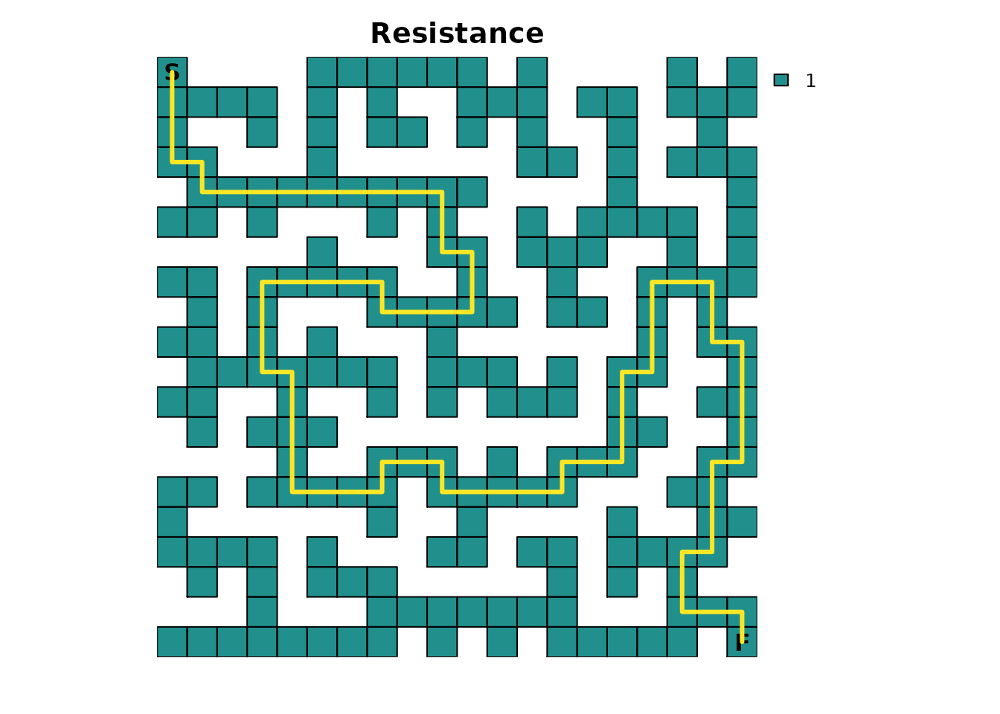

Create an absorption map where the finish point is the only source of
absorption. It will have an absorption value of `1.0`, which means that
once this point is entered, it cannot be left for another cell in the
maze:

``` r
# End of the maze
maze_finish <- maze_res * 0
maze_finish[20, 20] <- 1

plot_maze(maze_finish, "Absorption", vir_col)
```

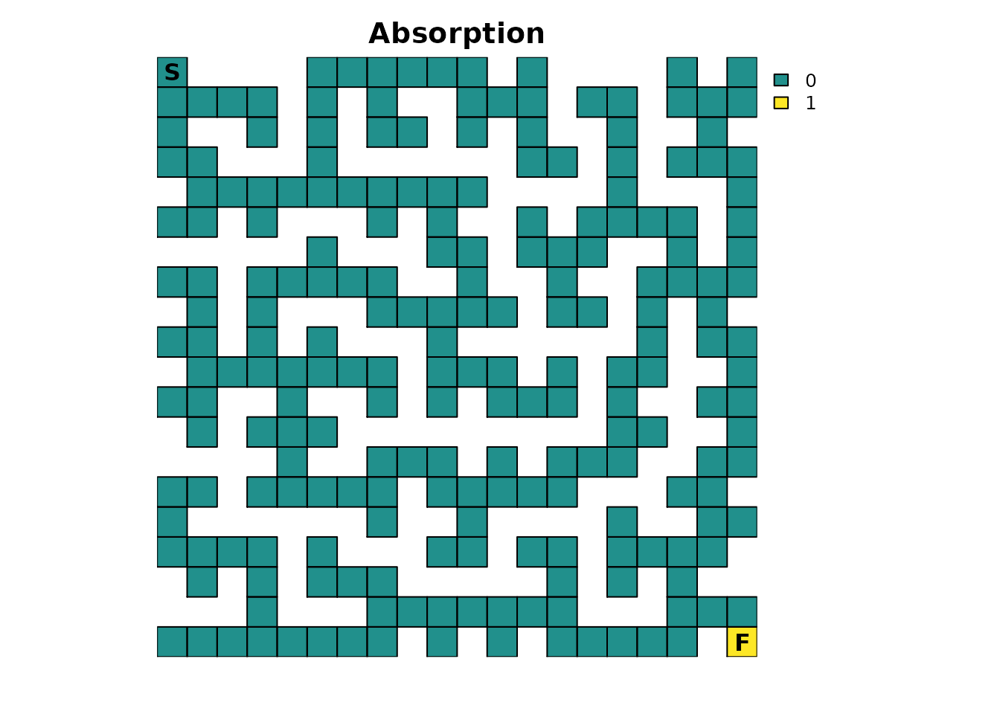

Given the nature of some of the calculations performed by the package,
it’s sometimes possible for floating point precision issues to arise
where equality comparisons between two decimal values don’t yield the
expected results. It’s an unfortunate limitation of all computer
hardware and is why functions like
[`all.equal()`](https://rspatial.github.io/terra/reference/all.equal.html)
exist in base R. Unfortunately, there isn’t a base function available
for the specific comparisons we want to perform, so we will manually
have to do it. To do so, we will need a tolerance value and will use the
default tolerance used by
[`all.equal()`](https://rspatial.github.io/terra/reference/all.equal.html):

``` r
tolerance = sqrt(.Machine$double.eps) # Default tolerance in functions like all.equal()

print(tolerance)
#> [1] 1.490116e-08
```

## Create the `samc` object

With the resistance and absorption maps prepared, a samc object can be
created:

``` r
rw_model <- list(fun = function(x) 1/mean(x), dir = 4, sym = TRUE)

maze_samc <- samc(maze_res, maze_finish, model = rw_model)

maze_origin <- locate(maze_samc, data.frame(x = 1, y = 20))
maze_dest <- locate(maze_samc, data.frame(x = 20, y = 1))
```

The model represented by this samc object has been set up to assume a
simple random walk. There is no “memory” of the past to stop the
individual from going back to dead ends, there is no ability to “look
ahead” and see dead ends, and the individual will always move to a
different cell every time step.

Note the use of only four directions. This prevents diagonal movements
in the maze, which in turn will have important consequences for
short-term metrics (discussed later).

The start and finish locations are obtained from the samc object using
the [`locate()`](https://andrewmarx.github.io/samc/reference/locate.md)
function. It’s important to remember that the results from
[`xyFromCell()`](https://rspatial.github.io/terra/reference/xyCellFrom.html)
(used above for the RasterLayer object) do *NOT* work for samc objects.
Although the results from both functions may be equivalent in certain
cases, they generally will not be equivalent and cannot be used
interchangeably.

## Time to finish

We will start with determining how long, on average, it would be
expected for a single individual to finish the maze. Formally, the
[`survival()`](https://andrewmarx.github.io/samc/reference/survival.md)
function calculates the expected time to absorption, but since the maze
has only one absorption point representing the finish point, this means
that, in this example,
[`survival()`](https://andrewmarx.github.io/samc/reference/survival.md)
can be interpreted as the expected time to finish the maze:

``` r
maze_surv <- survival(maze_samc)

plot_maze(map(maze_samc, maze_surv), "Expected time to finish", viridis(256))
```

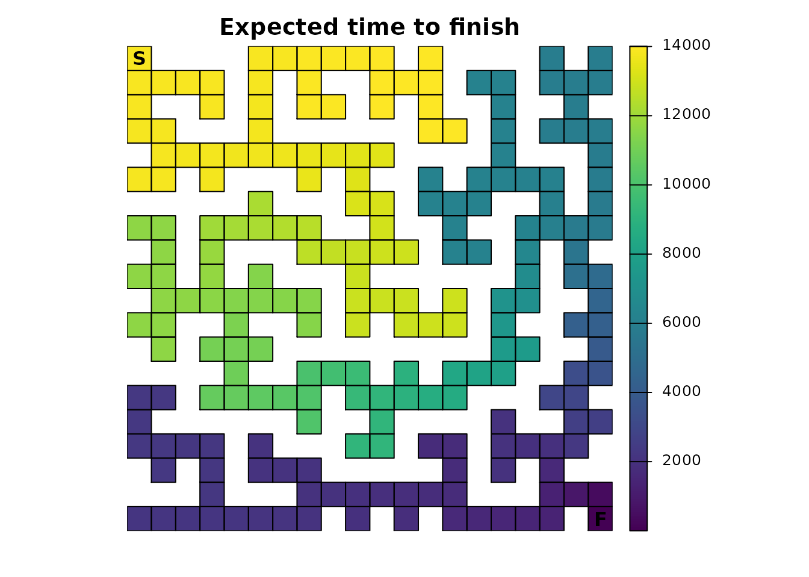

The result is a vector with the expected time to absorption, or finish,
for every point in the maze, not just the top left start point. The
start location can be used to extract that information from the vector:

``` r
maze_surv[maze_origin]
#> [1] 13869
```

When there is only a single point of total absorption, like in this
example,
[`survival()`](https://andrewmarx.github.io/samc/reference/survival.md)
and
[`cond_passage()`](https://andrewmarx.github.io/samc/reference/cond_passage.md)
are nearly identical when the destination for
[`cond_passage()`](https://andrewmarx.github.io/samc/reference/cond_passage.md)
is set to the point of absorption (the finish point):

``` r
maze_cond <- cond_passage(maze_samc, dest = maze_dest)

maze_cond[maze_origin]
#> [1] 13868
```

It turns out that the cell in the map corresponding to our finish point
is not an absorbing state; it’s still a transient state. Absorption
occurs one time step later when the individual is removed from the maze
since it can’t go anywhere else in our example. So
[`cond_passage()`](https://andrewmarx.github.io/samc/reference/cond_passage.md)
reports how long it takes to reach the final cell, and
[`survival()`](https://andrewmarx.github.io/samc/reference/survival.md)
tells us how long it takes us to reach the final cell and then be
removed from it.

A couple of things to keep in mind: -
[`survival()`](https://andrewmarx.github.io/samc/reference/survival.md)
will have different results and a different interpretation for the maze
in more complicated scenarios with multiple points of absorption. -
[`cond_passage()`](https://andrewmarx.github.io/samc/reference/cond_passage.md)
normally does not work when there are states that lead to total
absorption. The only exception is when there is a single instance of a
state leading to total absorption present and the `dest` parameter is
set to it. In that case, the absorption state is effectively ignored.
This is why
[`cond_passage()`](https://andrewmarx.github.io/samc/reference/cond_passage.md)
works as shown in this example, but attempting to change the `dest`
parameter to a different location will cause it to fail.
[`cond_passage()`](https://andrewmarx.github.io/samc/reference/cond_passage.md)
can still be used for other `dest` values, but first, the absorption
value would have to be changed to a value less than `1`.

## Probability of visiting a cell

If we’re interested in knowing the probability that a particular cell
(or cells) is visited at least once, then we can use the
[`dispersal()`](https://andrewmarx.github.io/samc/reference/dispersal.md)
function:

``` r
maze_disp <- dispersal(maze_samc, origin = maze_origin)
#> 
#> Cached diagonal not found.
#> Performing setup. This can take several minutes... Complete.
#> Calculating matrix inverse diagonal...
#> Computing: 100% (done)                         
#> Complete                                                      
#> Diagonal has been cached. Continuing with metric calculation...

plot_maze(map(maze_samc, maze_disp), "Probability of Visit", viridis(256))
```

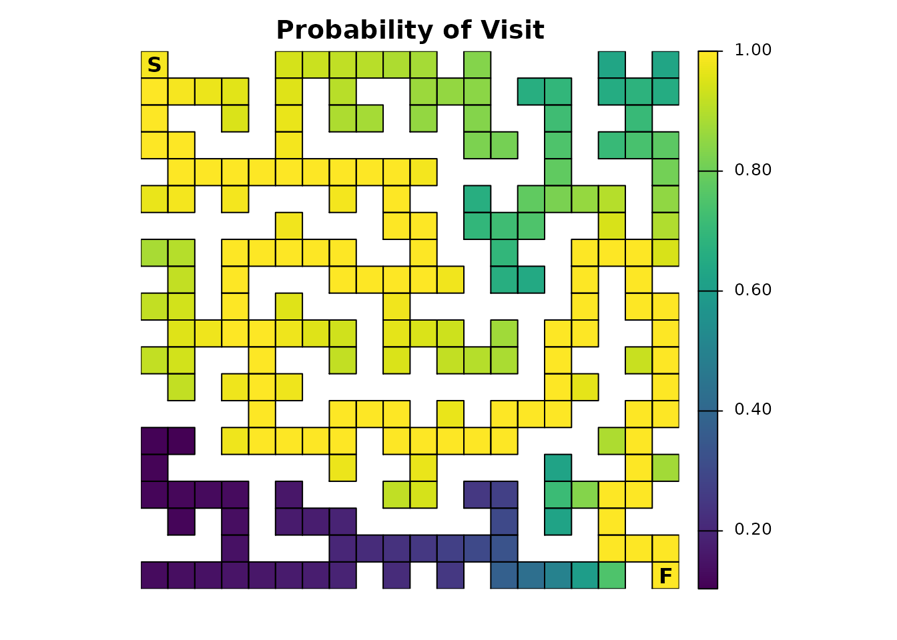

To complete the maze, the individual has to visit every cell along the
path to the exit, so all of those cells will have a probability of
`1.0`. The farther away from this path a cell is located, the lower the
probability it will be visited. Additionally, the closer the individual
gets to the finish, the less likely they will spend time taking
incorrect routes before stumbling upon the finish. There’s also the
possibility of scenarios like the one where the individual is near the
finish and then manages to stumble back to the start. These different
aspects contribute to more time spent near the start point, on average,
which in turn means that cells near the start have a higher probability
of being visited.

The previous paragraph hinted that the results from the
[`dispersal()`](https://andrewmarx.github.io/samc/reference/dispersal.md)
function can be used to identify the route through the maze:

``` r
# Ideally would use `as.numeric(maze_disp == 1)`, but floating point precision issues force an approximation
maze_disp_sol <- as.numeric(abs(maze_disp - 1) < tolerance)

plot_maze(map(maze_samc, maze_disp_sol), "Solution Using Dispersal()", vir_col)
```

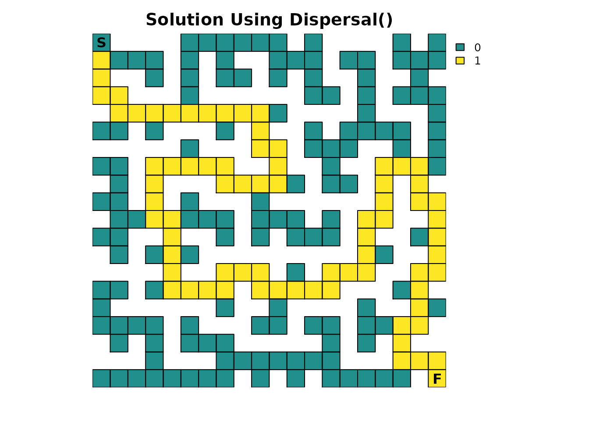

Like the
[`survival()`](https://andrewmarx.github.io/samc/reference/survival.md)
function, there is an important caveat: The visitation probabilities
don’t include time `0`. So while it looks like the starting cell might
have a probability of `1` in the first figure, it’s slightly less and it
just wasn’t apparent with the color scale:

``` r
maze_disp[maze_origin]
#> [1] 0.9864865
```

## Visits per cell

The package can be used to see how many times each cell in the maze is
expected to be visited on average. This is done using the
[`visitation()`](https://andrewmarx.github.io/samc/reference/visitation.md)
metric:

``` r
maze_visit <- visitation(maze_samc, origin = maze_origin)

plot_maze(map(maze_samc, maze_visit), "Visits Per Cell", viridis(256))
```

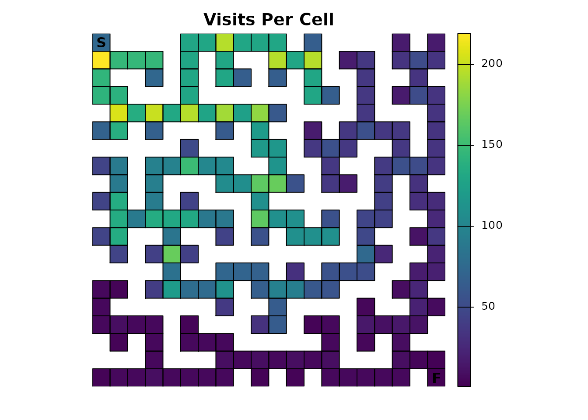

Since the finish point leads to total absorption, it will only be
visited once:

``` r
maze_visit[maze_dest]
#> [1] 1
```

## Expected location

Using the
[`distribution()`](https://andrewmarx.github.io/samc/reference/distribution.md)
function, the location of an individual in the maze can be predicted for
a given time:

``` r
maze_dist <- distribution(maze_samc, origin = maze_origin, time = 20)

plot_maze(map(maze_samc, maze_dist), "Location at t=20", col = viridis(256))
```

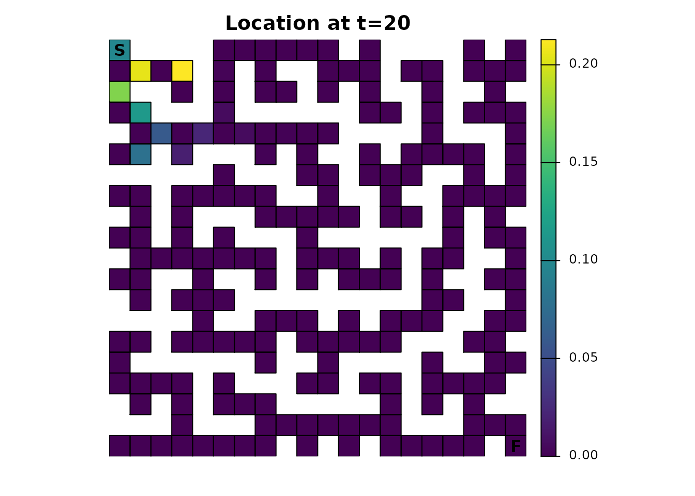

There’s an odd pattern here that can be emphasized by incrementing the
time from 20 to 21:

``` r
maze_dist <- distribution(maze_samc, origin = maze_origin, time = 21)

plot_maze(map(maze_samc, maze_dist), "Location at t=21", viridis(256))
```

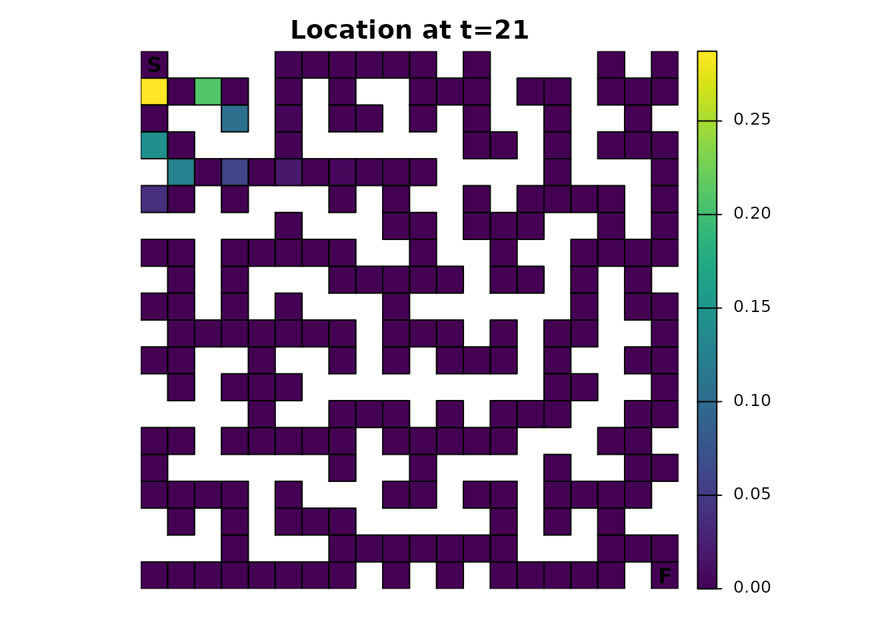

Earlier it was mentioned that using only 4 directions for the transition
function would have consequences. Without either diagonal transitions or
some form of fidelity (the possibility of an individual not moving),
there will be an alternating pattern where a cell can and then cannot be
occupied. It’s easiest to reason about the effect by running the same
function for time steps 1-5 and visualizing it, an exercise that will be
left to those interested.

## Other metrics

There are a couple of metrics that have not been covered yet:
[`absorption()`](https://andrewmarx.github.io/samc/reference/absorption.md)
and
[`mortality()`](https://andrewmarx.github.io/samc/reference/mortality.md).
For the example provide thus far, they don’t do anything useful.
[`mortality()`](https://andrewmarx.github.io/samc/reference/mortality.md)
would only report a 100% probability of absorption at the finish point;
it will be more useful when there are multiple locations with absorption
probabilities.
[`absorption()`](https://andrewmarx.github.io/samc/reference/absorption.md)
is only useful when there are different *types* of absorption.

## Occupancy

Many of the metrics offer a more advanced and flexible option for
setting an initial state in the absorbing Markov chain. Inputs to the
`init` parameter (short for initial state) can essentially be used as an
alternative to specifying a singular start point. Here is an example
`init` map that represents the scenario that has been presented so far:

``` r
maze_init <- maze_res * 0
maze_init[1, 1] <- 1

plot_maze(maze_init, "Occupancy", vir_col)
```

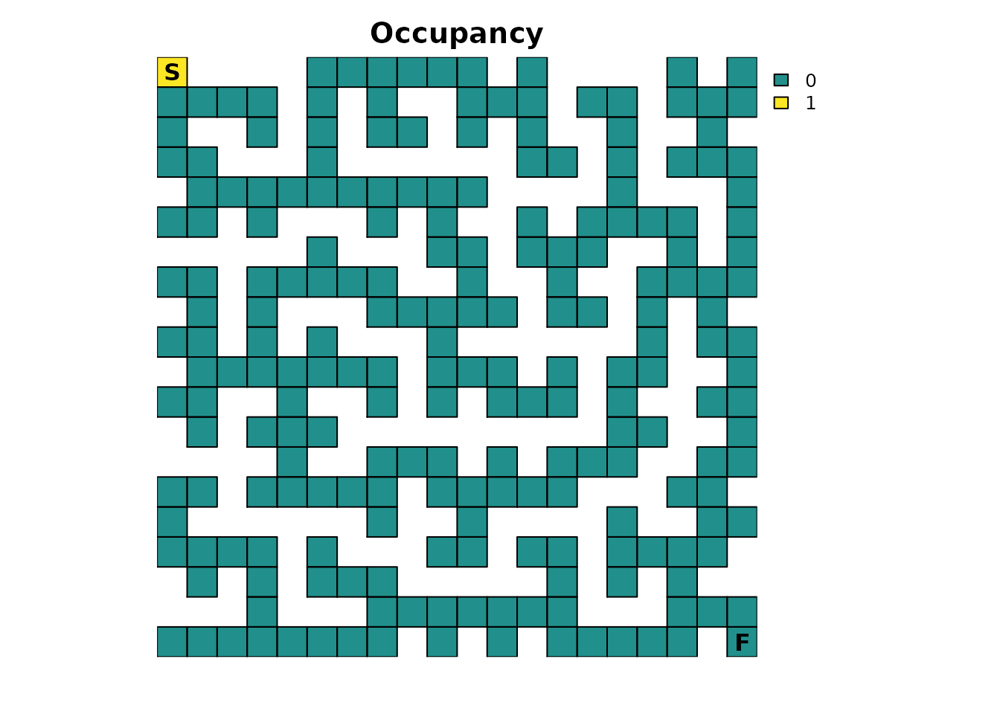

Using the
[`survival()`](https://andrewmarx.github.io/samc/reference/survival.md)
metric, it produces the same result as before:

``` r
survival(maze_samc, init = maze_init)
#> [1] 13869

maze_surv[maze_origin]
#> [1] 13869
```

But now, more interesting scenarios can be tested. For example, let’s
start the maze with 3 individuals:

``` r
# Scenario 1: 3 people start in the maze
maze_init3 <- maze_res * 0
maze_init3[1, 1] <- 3

survival(maze_samc, init = maze_init3)
#> [1] 41607
```

The interpretation becomes a little trickier here. The
[`survival()`](https://andrewmarx.github.io/samc/reference/survival.md)
metric is returning the cumulative time spent in the maze for *all* the
individuals. This means that with 3 individuals starting at the
beginning, 3 times as much time is going to be spent in the maze, but
per individual, it will still take the same number of time steps to
finish as before:

``` r
survival(maze_samc, init = maze_init3) / 3
#> [1] 13869
```

Here’s a different scenario with 3 individuals again, but now they start
in different corners of the maze:

``` r
# Scenario 2: A person starts in each corner of the maze
maze_init3 <- maze_res * 0
maze_init3[1, 1] <- 1
maze_init3[20, 1] <- 1
maze_init3[1, 20] <- 1

plot_maze(maze_init3, "Occupancy", vir_col)

survival(maze_samc, init = maze_init3)
#> [1] 21949
```

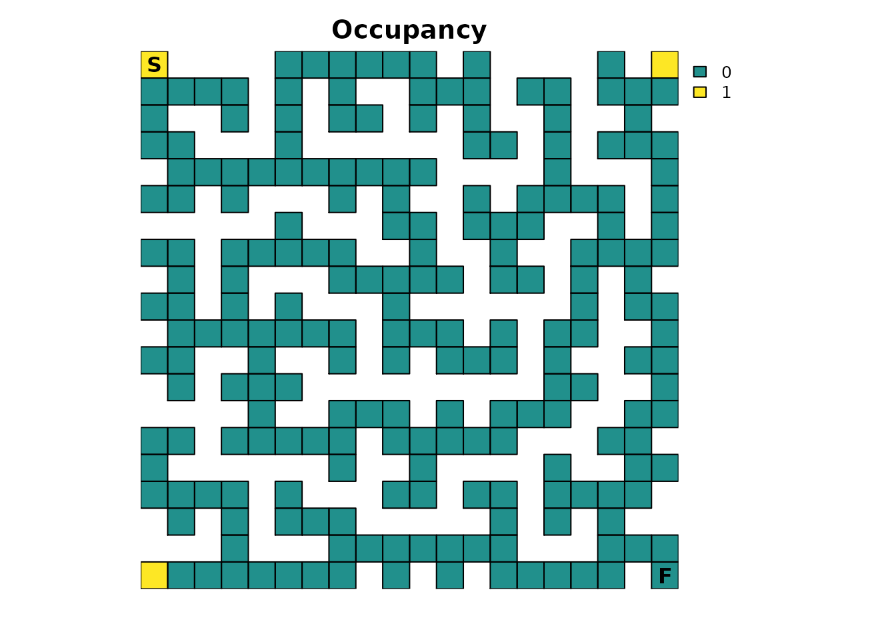

Again, the cumulative time spent in the maze is larger than reported in
the original scenario with one individual. However, this time the
average time per individual spent in the maze decreases:

``` r
survival(maze_samc, init = maze_init3) / 3
#> [1] 7316.333
```

This is because the additional individuals are now located in corners
that are substantially closer to the finish point, so they would be
expected to find it faster on average. Based on where each individual
starts, it would be reasonable to expect that the individual starting in
the bottom left has the biggest advantage. One way to try and visualize
this is with the `distrbution()` metric:

``` r
maze_init3_dist <- distribution(maze_samc, init = maze_init3, time = 17)

# This makes it easier to see how far along the individuals could be
maze_init3_dist <- as.numeric(maze_init3_dist > 0)

plot_maze(map(maze_samc, maze_init3_dist), "Location at t=17", viridis(256))
```

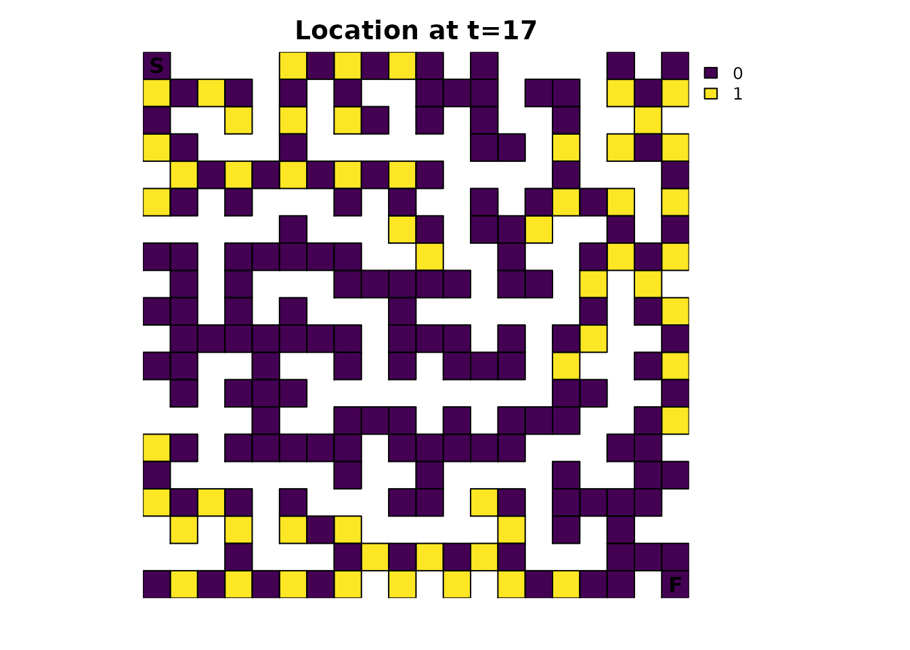

A good exercise for the reader is to apply the concepts of the
animations vignette to this figure.

## Future parts

In future parts, many different modifications will be made to the maze
to explore how they change the results of different metrics and how the
different metrics are related. These modifications include the use of
fidelity to simulate scenarios where the individual pauses to think
about their next decision, modifying the resistance input to simulate
“looking ahead” to perform dead-end avoidance, and modifying the
absorption input to simulate different sources of absorption such as
lethal traps.
