# Maze Part 2

## Introduction

[Part
1](https://andrewmarx.github.io/samc/articles/example-maze-part1.md) of
this series explored the applications of absorbing Markov chains in the
context of a simple perfect maze. This part of the series will expand on
the simple maze in various ways and explore how these changes affect
interpretations of the different metrics offered in the samc package.

The complete code for this series is available on
[Github](https://github.com/andrewmarx/samc/blob/main/vignettes/scripts/example-maze.R).

## Setup

Part 2 reuses the code from [Part
1](https://andrewmarx.github.io/samc/articles/example-maze-part2.md).

## Fidelity

The first change explored in this part will be the incorporation of
fidelity into the samc object. In Part 1, transitions always occurred
from one cell to a different neighboring cell. With fidelity,
transitions can occur from a cell to itself; essentially, there’s no
movement during a time step. There are potentially many different ways
that fidelity could be applied to the maze, but for simplicity, this
example will keep things simple by using it to create a delay in
movement at intersections. The goal is to model “hesitation” when an
individual is presented with the choice of three or more paths. For
additional simplicity, all intersections will be treated the same and
assigned a fidelity probability of `0.1`, which means that once an
individual is at an intersection, there is a 10% probability that they
will stay in the intersection from one time step to the next.

``` r
# Intersections determined using a moving window function
ints_res <- focal(maze_res,
                  w = matrix(c(NA, 1, NA, 1, 1, 1, NA, 1, NA), nrow = 3, ncol = 3),
                  fun = function(x) {sum(!is.na(x)) > 3})

ints_res[is.na(maze_res)] <- NA
ints_res <- ints_res * 0.1

plot_maze(ints_res, "Intersections", vir_col)
```

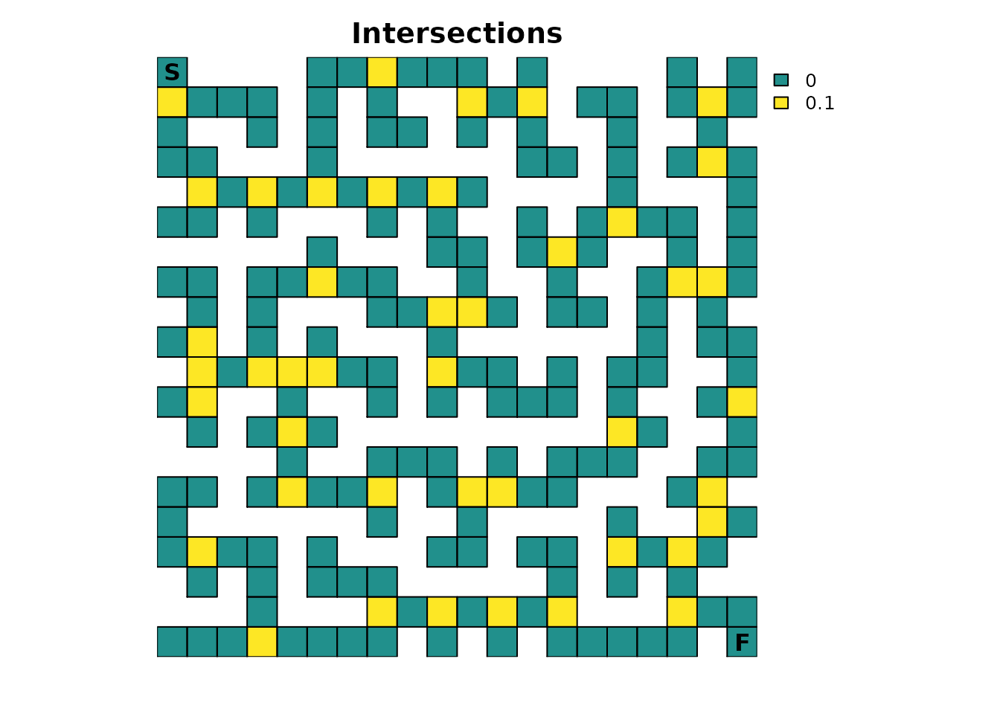

Fidelity changes the P matrix underlying the samc object, which means
that the samc object has to be recreated:

``` r
ints_samc <- samc(maze_res, maze_finish, ints_res, model = rw_model)
```

To start, let’s see how the new fidelity input affects the expected time
to finish:

``` r
# Original results from Part 1
survival(maze_samc)[maze_origin]
#> [1] 13869
cond_passage(maze_samc, origin = maze_origin, dest = maze_dest)
#> [1] 13868

# Results with fidelity at intersections
survival(ints_samc)[maze_origin]
#> [1] 14356
cond_passage(ints_samc, origin = maze_origin, dest = maze_dest)
#> [1] 14355
```

Intuitively, with “hesitation” added to the movement, the expected time
to finish increases. Also, note that incorporating fidelity in this
particular example does not affect the relationship between
[`survival()`](https://andrewmarx.github.io/samc/reference/survival.md)
and
[`cond_passage()`](https://andrewmarx.github.io/samc/reference/cond_passage.md).

In terms of the probability of visiting any particular cell, changing
the fidelity does not change the results from Part 1:

``` r
ints_disp <- dispersal(ints_samc, origin = maze_origin)
#> 
#> Cached diagonal not found.
#> Performing setup. This can take several minutes... Complete.
#> Calculating matrix inverse diagonal...
#> Computing: 100% (done)                         
#> Complete                                                      
#> Diagonal has been cached. Continuing with metric calculation...

all.equal(maze_disp, ints_disp)
#> [1] TRUE
```

Fidelity does, however, change the number of times each cell is expected
to be visited:

``` r
ints_visit <- visitation(ints_samc, origin = maze_origin)

all.equal(maze_visit, ints_visit)
#> [1] "Mean relative difference: 0.03511428"

# Let's plot the difference to see if there is a noticeable pattern
visit_diff <- map(maze_samc, ints_visit) - map(maze_samc, maze_visit)
plot_maze(visit_diff, "Visits Per Cell (Difference)", viridis(256))
```

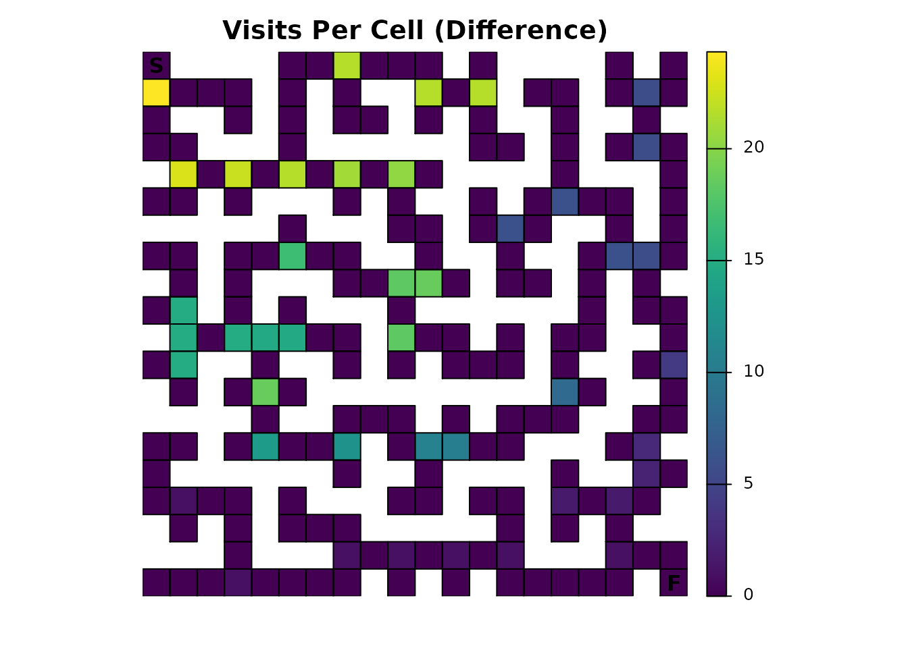

With fidelity present, the intersections are seeing a significantly
different number of visits. Since a “visit” effectively represents a
transition to a cell from one time step to the next, the presence of
fidelity means that the metric is counting transitions from a cell to
itself as well. Interestingly, when compared to the figure in Part 1,
the legend in this figure seems to indicate that the increase for the
intersections might be 10%, or the same as the fidelity probabilities.
It also seems like the non-intersections (cells with a fidelity
probability of `0.0`) experienced no change. Let’s check these ideas:

``` r
# First, let's see which cells changed.
# Ideally would just use `visit_diff > 0`, but floating point precision issues force an approximation
plot_maze(visit_diff > tolerance, "Visits With Non-Zero Difference", vir_col)

# Second, let's see what the percent change is for our non-zero differences.
visit_perc <- (ints_visit - maze_visit) / maze_visit
visit_perc[visit_perc>tolerance]
#>  [1] 0.1111111 0.1111111 0.1111111 0.1111111 0.1111111 0.1111111 0.1111111
#>  [8] 0.1111111 0.1111111 0.1111111 0.1111111 0.1111111 0.1111111 0.1111111
#> [15] 0.1111111 0.1111111 0.1111111 0.1111111 0.1111111 0.1111111 0.1111111
#> [22] 0.1111111 0.1111111 0.1111111 0.1111111 0.1111111 0.1111111 0.1111111
#> [29] 0.1111111 0.1111111 0.1111111 0.1111111 0.1111111 0.1111111 0.1111111
#> [36] 0.1111111 0.1111111 0.1111111 0.1111111 0.1111111 0.1111111 0.1111111
#> [43] 0.1111111
```

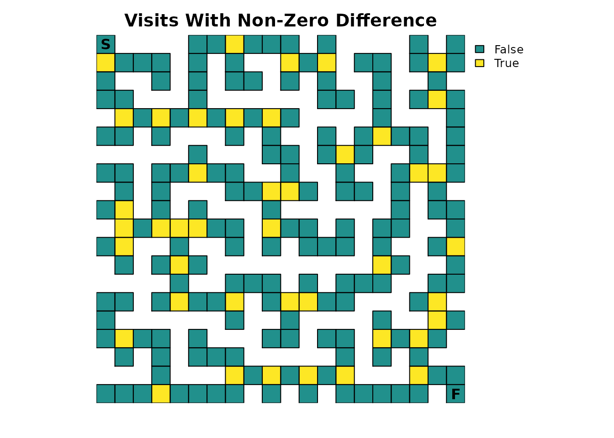

It turns out that there is no change in the number of expected visits
for non-intersections. It also turns out that our hunch for the
intersections was only partially true; the change is constant, but it’s
1/9 instead of 0.1 or 10%.

The most interesting change from incorporating fidelity might be with
the
[`distribution()`](https://andrewmarx.github.io/samc/reference/distribution.md)
metric. Recall from Part 1 that there was an alternating pattern with
the cells when changing the time steps. With fidelity, this effect still
exists, but not to the same degree:

``` r
ints_dist <- distribution(ints_samc, origin = maze_origin, time = 20)
plot_maze(map(ints_samc, ints_dist), "Location at t=20", viridis(256))

ints_dist <- distribution(ints_samc, origin = maze_origin, time = 21)
plot_maze(map(ints_samc, ints_dist), "Location at t=21", viridis(256))
```

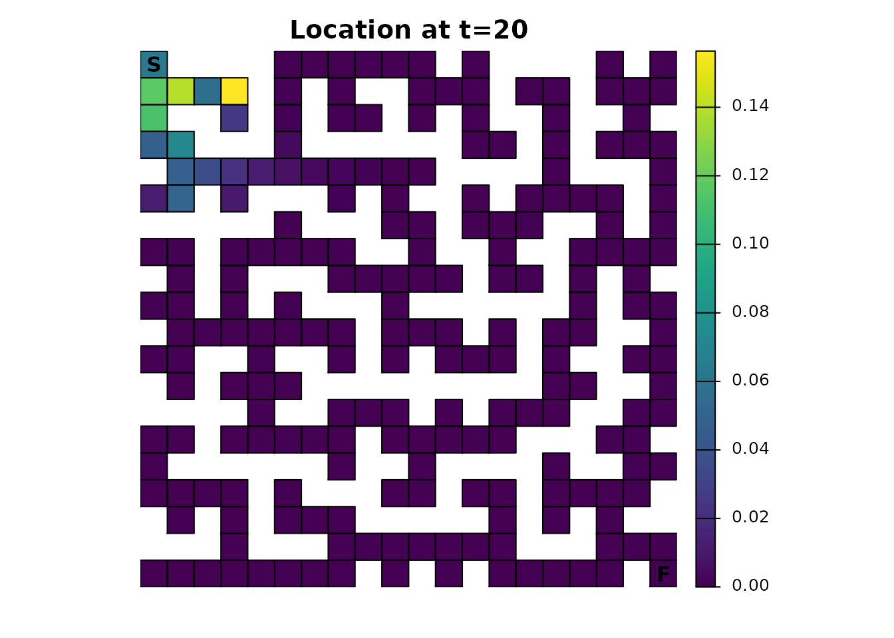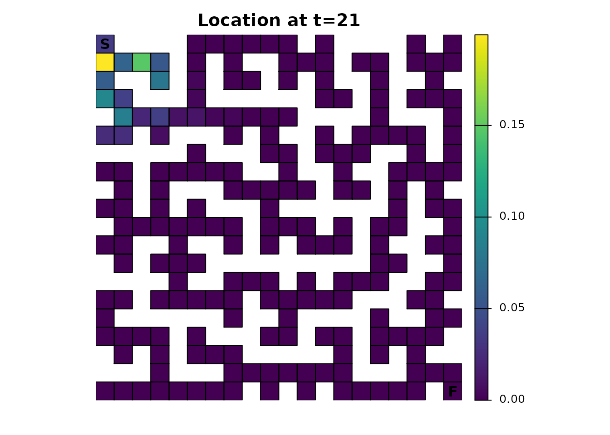

Given a sufficient amount of time, the cumulative effect of having
fidelity present will almost entirely eliminate this pattern. Even from
time steps 200-201, the alternating pattern is visually nearly gone:

``` r
ints_dist <- distribution(ints_samc, origin = maze_origin, time = 200)
plot_maze(map(ints_samc, ints_dist), "Location at t=200", viridis(256))

ints_dist <- distribution(ints_samc, origin = maze_origin, time = 201)
plot_maze(map(ints_samc, ints_dist), "Location at t=201", viridis(256))
```

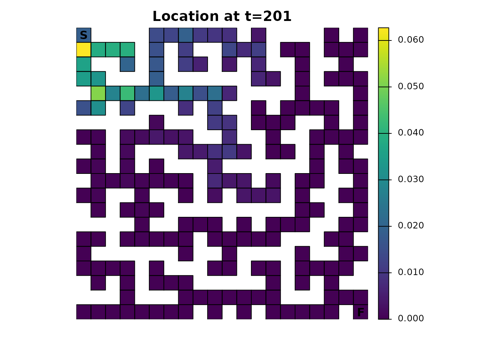

For comparison, here’s the original samc object using the same time
steps:

``` r
maze_dist <- distribution(maze_samc, origin = maze_origin, time = 200)
plot_maze(map(maze_samc, maze_dist), "Location at t=200", viridis(256))

maze_dist <- distribution(maze_samc, origin = maze_origin, time = 201)
plot_maze(map(maze_samc, maze_dist), "Location at t=201", viridis(256))
```

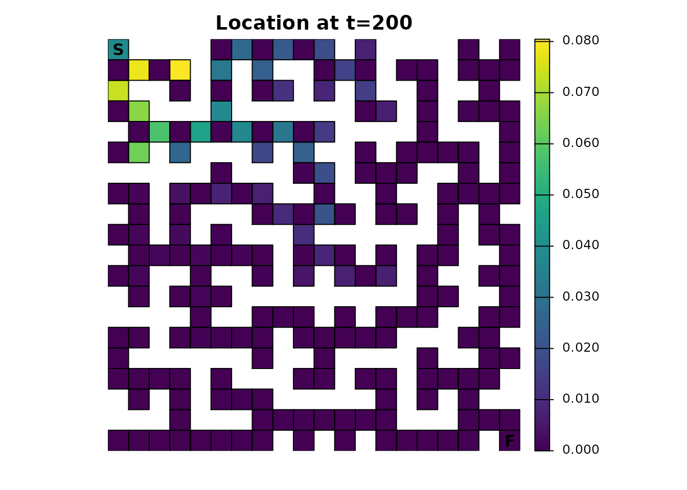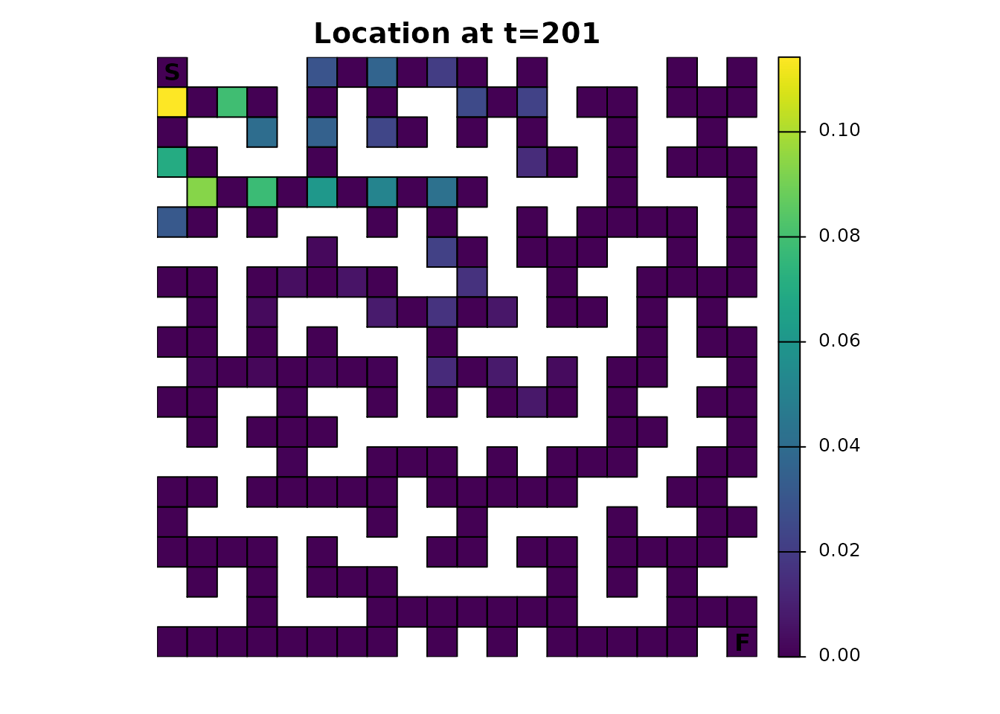

## Dead-End Avoidance

Technically, the package doesn’t offer the ability to “look ahead” at
future states to adjust the transition probabilities. In other words, if
a route would eventually lead to a dead end, there’s nothing in the
[`samc()`](https://andrewmarx.github.io/samc/reference/samc.md) function
or the metric functions to account for that or model the possibility
that an individual in the maze can see down a hallway. It can, however,
be faked somewhat by adjusting the resistance map so that the dead ends
have a much higher resistance. This will reduce the probability of an
individual entering a dead end, almost as if they looked ahead. A
sliding window function can be used to create this new map:

``` r
# Dead ends
ends_res <- focal(maze_res,
                  w = matrix(c(NA, 1, NA, 1, 1, 1, NA, 1, NA), nrow = 3, ncol = 3),
                  fun = function(x){sum(!is.na(x)) == 2})
ends_res[is.na(maze_res)] <- NA
ends_res <- ends_res * 9 + 1
ends_res[20, 20] <- 1

plot_maze(ends_res, "Dead Ends", vir_col)
```

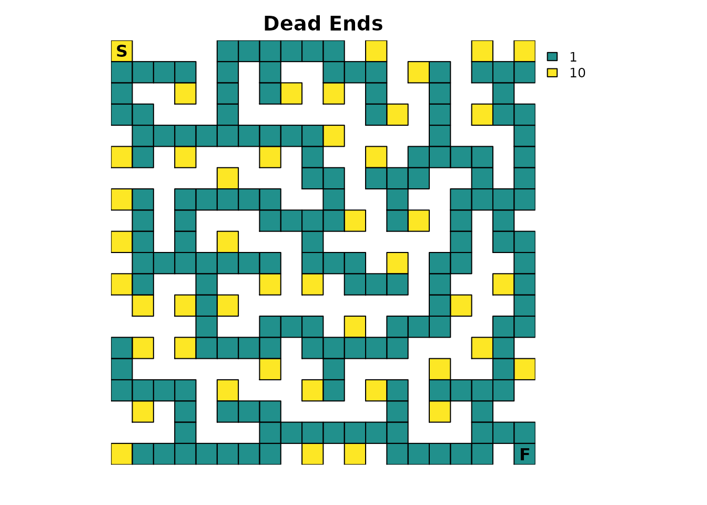

The dead ends have been assigned a resistance value of `10`, which is
relatively high and means that dead ends will only rarely be entered.
Since the resistance map has been modified, the samc object will need to
be recreated. The fidelity data from the previous section will not be
used, which will allow direct comparisons against the model created in
Part 1.

``` r
ends_samc <- samc(ends_res, maze_finish, model = rw_model)
```

Hypothetically, since an individual can now “look ahead”, they should be
able to get through the maze faster because they are spending less time
in dead ends. This is easily verified:

``` r
# Original results from Part 1
survival(maze_samc)[maze_origin]
#> [1] 13869
cond_passage(maze_samc, origin = maze_origin, dest = maze_dest)
#> [1] 13868

# Results with dead ends
survival(ends_samc)[maze_origin]
#> [1] 11313
cond_passage(ends_samc, origin = maze_origin, dest = maze_dest)
#> [1] 11312
```

Since the dead ends have a lower probability of being transitioned to,
the
[`dispersal()`](https://andrewmarx.github.io/samc/reference/dispersal.md)
and
[`visitation()`](https://andrewmarx.github.io/samc/reference/visitation.md)
metrics should reflect that:

``` r
ends_disp <- dispersal(ends_samc, origin = maze_origin)
#> 
#> Cached diagonal not found.
#> Performing setup. This can take several minutes... Complete.
#> Calculating matrix inverse diagonal...
#> Computing: 100% (done)                         
#> Complete                                                      
#> Diagonal has been cached. Continuing with metric calculation...
plot_maze(map(maze_samc, ends_disp), "Probability of Visit", viridis(256))

ends_visit <- visitation(ends_samc, origin = maze_origin)
plot_maze(map(maze_samc, ends_visit), "Visits Per Cell", viridis(256))
```

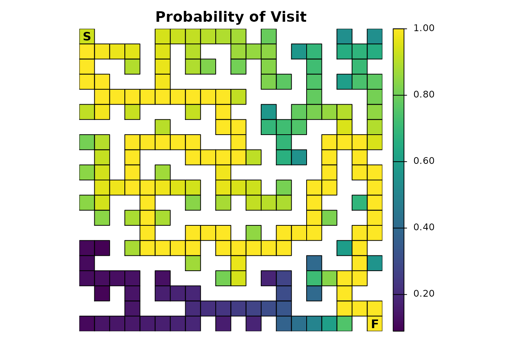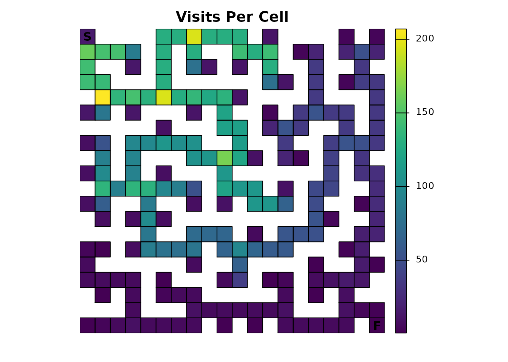

The effect is more obvious with the expected number of visits from
[`visitation()`](https://andrewmarx.github.io/samc/reference/visitation.md);
the probability illustration is more subtle compared to the original
results in Part 1. This could be explored similarly to how some of the
differences in the fidelity section are illustrated, an exercise that
will be left to interested readers.

## Traps

It’s fairly to trivial to add lethal traps to the maze by updating the
absorption input to the
[`samc()`](https://andrewmarx.github.io/samc/reference/samc.md)
function. The key thing to keep in mind is that the
[`samc()`](https://andrewmarx.github.io/samc/reference/samc.md) function
expects the *total* absorption, so it will only be provided a single
absorption input. However, the package can be used to tease apart the
role that different sources of absorption will have in the model. There
are two different approaches to setting this up:

1.  Start with a single total absorption input. Then take that input and
    decompose it into multiple absorption components.
2.  Start with multiple absorption components. Then take those inputs
    and combine them into a single total absorption input.

The choice depends on the data available and the goals of the project.
For example, the first strategy is useful if we’ve somehow measured
total absorption for a model and want to explore different hypotheses
for how it breaks down into different types of absorption. The second is
useful if we already have direct knowledge of different sources of
absorption.

This example will take the second approach. One absorption component has
already been created for the finish point. A second simple absorption
component will be created that represents a few traps with a `0.2` or
20% absorption probability:

``` r
# Traps absorption layer
maze_traps <- maze_res * 0
maze_traps[17, 3] <- 0.2
maze_traps[1, 9] <- 0.2
maze_traps[6, 20] <- 0.2

plot_maze(maze_traps, "Traps", vir_col)
```

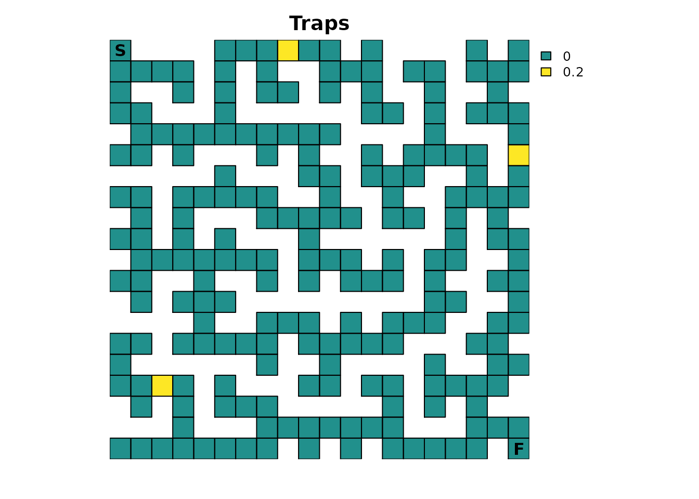

Since the total absorption is the sum of these two components, the samc
object will have to be recreated:

``` r
maze_abs_total <- maze_finish + maze_traps

traps_samc <- samc(maze_res, maze_abs_total, model = rw_model)
```

For easy comparison, everything else will be kept the same as the
original example from Part 1. Continuing the previous strategy, let’s
start with determining how long it is expected for an individual to
finish the maze:

``` r
# Original results from Part 1
survival(maze_samc)[maze_origin]
#> [1] 13869
cond_passage(maze_samc, origin = maze_origin, dest = maze_dest)
#> [1] 13868

# Results with traps
survival(traps_samc)[maze_origin]
#> [1] 1330.26
cond_passage(traps_samc, origin = maze_origin, dest = maze_dest)
#> [1] 3060.207
```

The results are drastically different from what has been seen before.
First, the clear relationship between
[`survival()`](https://andrewmarx.github.io/samc/reference/survival.md)
and
[`cond_passage()`](https://andrewmarx.github.io/samc/reference/cond_passage.md)
no longer exists. This is because
[`survival()`](https://andrewmarx.github.io/samc/reference/survival.md)
has a different interpretation in this context and no longer determines
how long it will take to finish; instead, it now calculates how long it
will take an individual to either finish *or* be absorbed in one of the
traps (i.e., die). This also drastically changes the plotting results of
[`survival()`](https://andrewmarx.github.io/samc/reference/survival.md)
(note the change in figure title from Part 1 to reflect the new
interpretation):

``` r
traps_surv <- survival(traps_samc)

# Note the updated title from part 1
plot_maze(map(maze_samc, traps_surv), "Expected Time to Absorption", viridis(256))
```

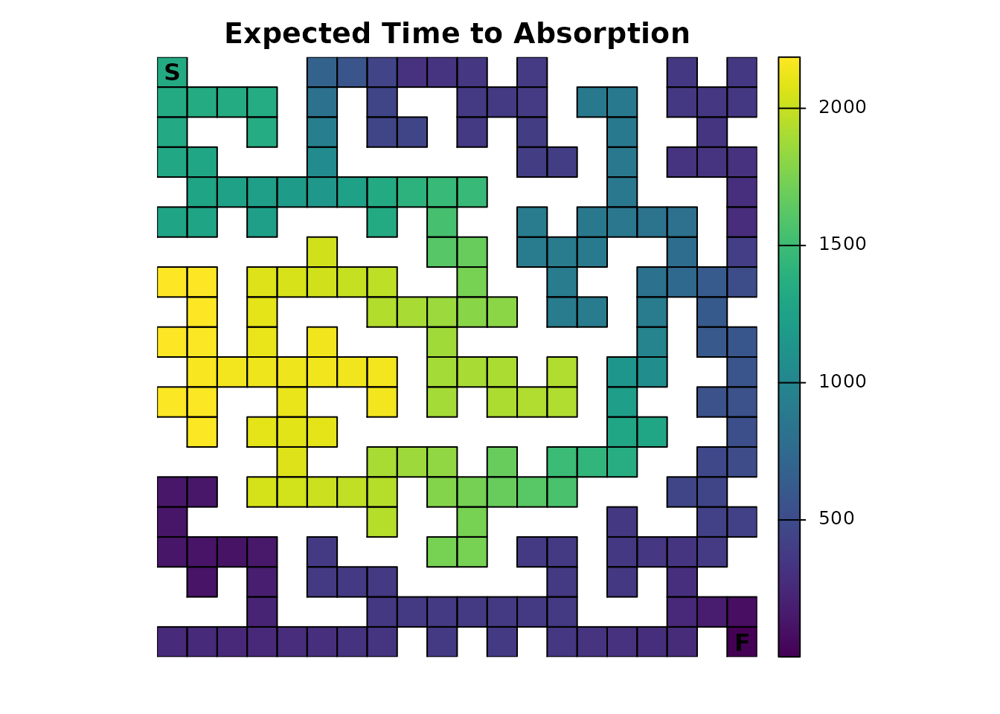

The results are also drastically different from Part 1 when looking at
visitation probability and the number of visits:

``` r
traps_disp <- dispersal(traps_samc, origin = maze_origin)
#> 
#> Cached diagonal not found.
#> Performing setup. This can take several minutes... Complete.
#> Calculating matrix inverse diagonal...
#> Computing: 100% (done)                         
#> Complete                                                      
#> Diagonal has been cached. Continuing with metric calculation...
plot_maze(map(traps_samc, traps_disp), "Probability of Visit", viridis(256))

traps_visit <- visitation(traps_samc, origin = maze_origin)
plot_maze(map(traps_samc, traps_visit), "Visits Per Cell", viridis(256))
```

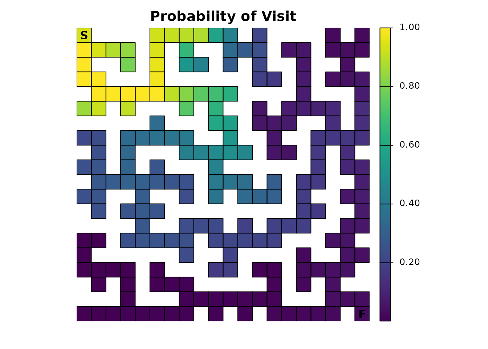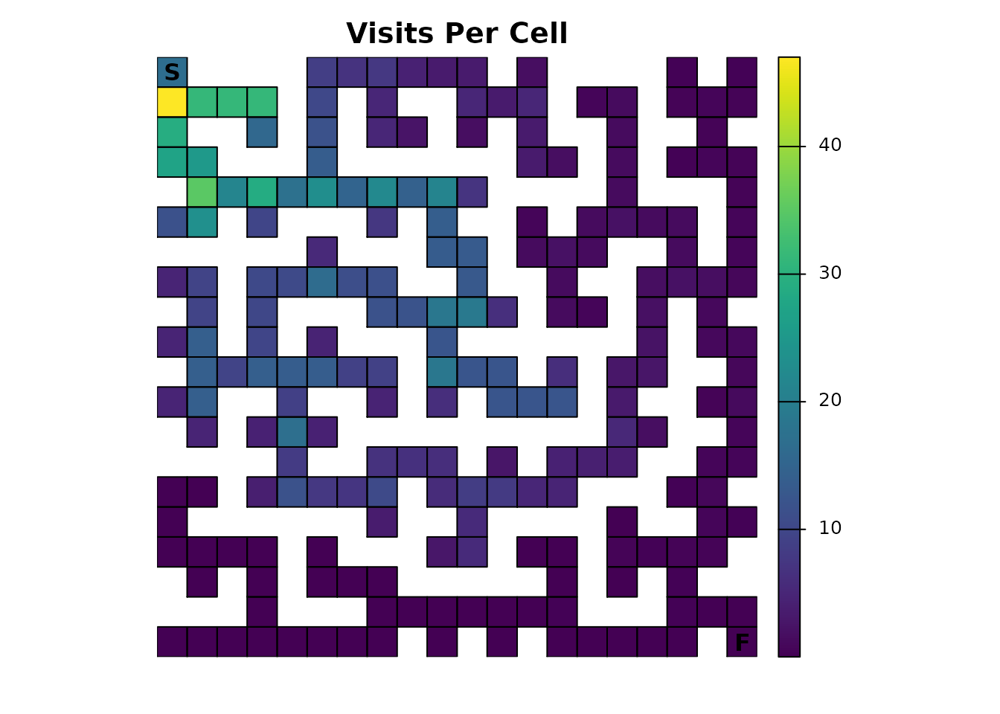

Importantly, the technique in Part 1 of using visitation probabilities
of `1.0` to identify the route through the maze will not work in this
example; it only works in very specialized cases. The reason is simple:
since an individual can now be absorbed in other locations, there is a
non-zero probability that they never reach the finish, which in turn
means the probability of visiting the finish is now less than 1.0.
However, the same technique can be used to see something interesting:

``` r
# Ideally, we would just use `as.numeric(traps_disp == 1)`, but we have floating point precision issues here, so we will approximate it
traps_disp_route <- as.numeric(abs(traps_disp - 1) < tolerance)

plot_maze(map(traps_samc, traps_disp_route), "dispersal() == 1", vir_col)
```

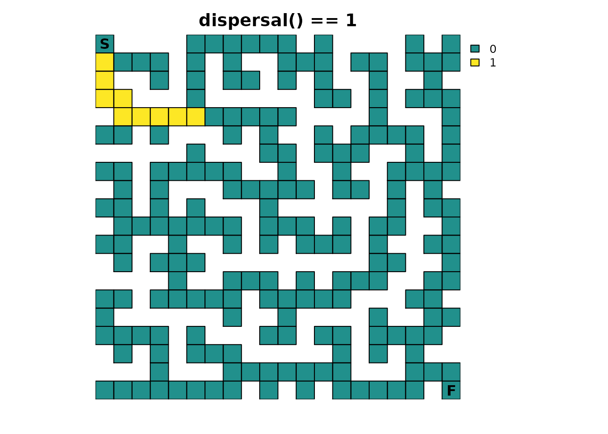

It shows part of the solution observed before, but only up to the first
maze intersection that leads to two or more possible sources of
absorption.

## Additional metrics

The inclusion of multiple absorption states makes the metrics that were
not useful in Part 1 more relevant. Starting with
[`mortality()`](https://andrewmarx.github.io/samc/reference/mortality.md),
it is possible to visualize where an individual is expected to be
absorbed:

``` r
traps_mort <- mortality(traps_samc, origin = maze_origin)

plot_maze(map(traps_samc, traps_mort), "Absorption Probability", viridis(256))
```

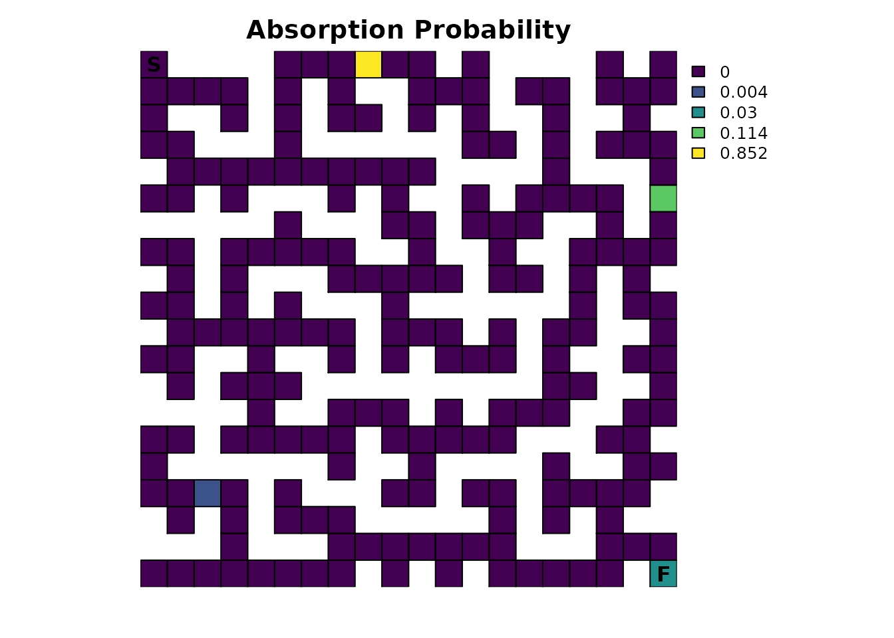

This result is quite possibly unexpected. Why does the finish point look
like it’s `0`? Looking at the numbers might provide insight:

``` r
traps_mort[traps_mort > 0]
#> [1] 0.852084306 0.113761093 0.003940915 0.030213685

traps_mort[maze_dest]
#> [1] 0.03021369
```

There’s only a 3.0% chance of an individual finishing the maze! This
might seem low given the traps are only lethal 20% of the time, but it
makes sense. Recall the [Probability of visiting a
cell](https://andrewmarx.github.io/samc/articles/example-maze-part1.html#probability-of-visiting-a-cell-1)
and [Visits per
cell](https://andrewmarx.github.io/samc/articles/example-maze-part1.html#visits-per-cell-1)
sections from Part 1; an individual spends most of their time in the
early part of the maze. That means they have a lot more exposure to the
first trap and, consequently, are more likely to be absorbed there with
an 85.2% probability. For the trap farthest from the start, reaching it
first requires passing by the finish, so consequently, it has only a
0.39% of being the source of absorption, a substantially lower
probability than just finishing the maze.

It is possible to break down the total absorption so that the role of
different sources of absorption can be investigated more easily. Now
that the samc object has been created, it can be provided the original
absorption layers that were used to calculate the total absorption:

``` r
# Naming the rasters will make things easier and less prone to user error later
names(maze_finish) <- "Finish"
names(maze_traps) <- "Traps"

traps_samc$abs_states <- c(maze_finish, maze_traps)
```

By doing so, the
[`mortality()`](https://andrewmarx.github.io/samc/reference/mortality.md)
metric now returns a list with information about not just the total
absorption, but the individual components as well. This allows the role
of different types of absorption to be individually accessed and
visualized:

``` r
traps_mort_dec <- mortality(traps_samc, origin = maze_origin)

str(traps_mort_dec)
#> List of 3
#>  $ total : num [1:215] 0 0 0 0 0.852 ...
#>  $ Finish: num [1:215] 0 0 0 0 0 0 0 0 0 0 ...
#>  $ Traps : num [1:215] 0 0 0 0 0.852 ...

plot_maze(map(traps_samc, traps_mort_dec$Finish), "Absorption Probability (Finish)", viridis(256))
plot_maze(map(traps_samc, traps_mort_dec$Traps), "Absorption Probability (Traps)", viridis(256))
```

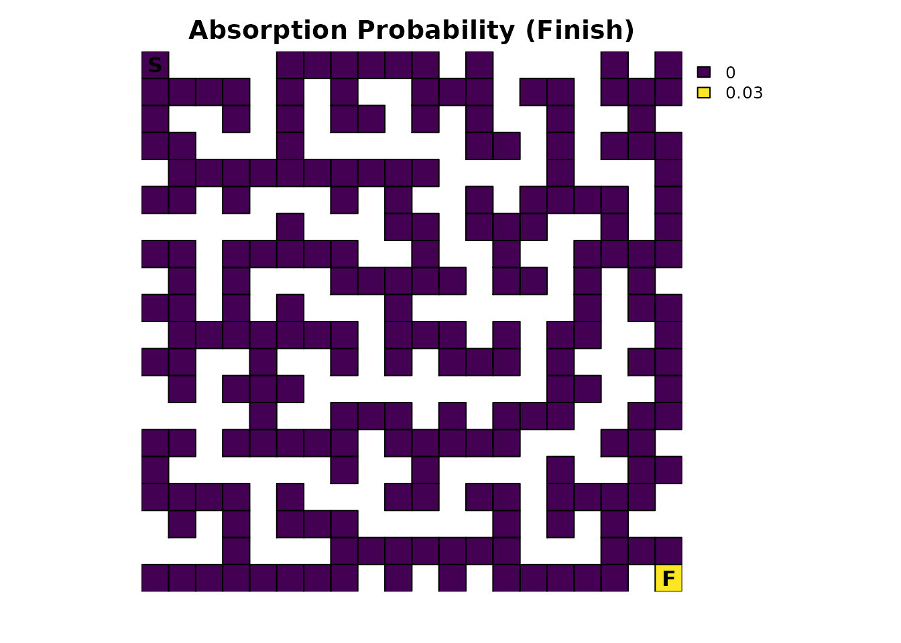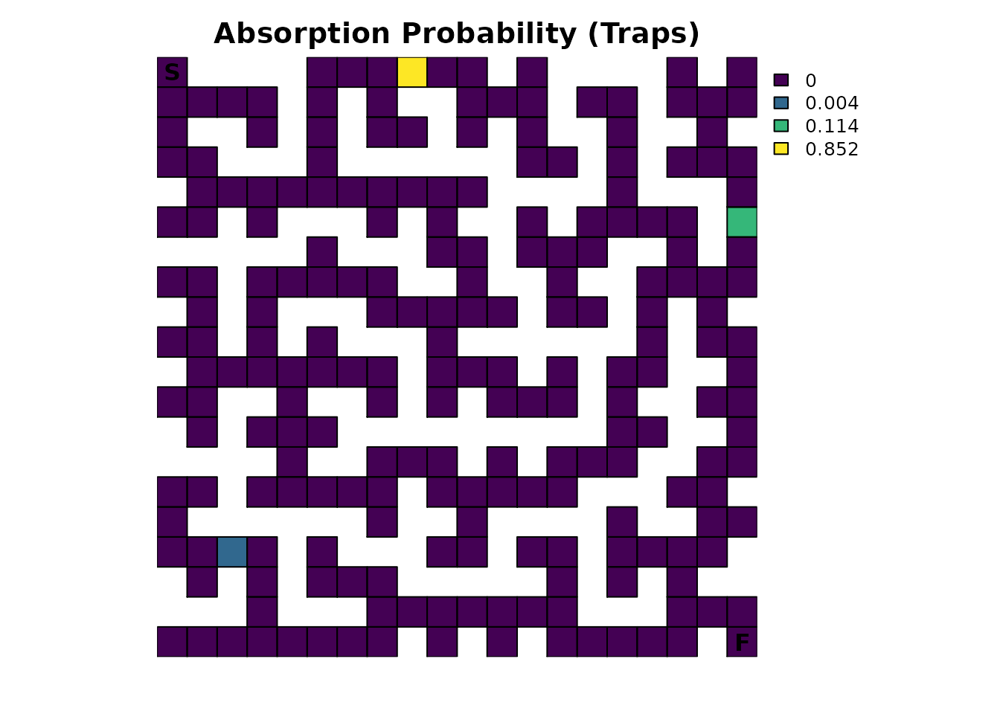

With multiple sources of absorption now specified in the samc object,
the
[`absorption()`](https://andrewmarx.github.io/samc/reference/absorption.md)
metric becomes relevant:

``` r
absorption(traps_samc, origin = maze_origin)
#>     Finish      Traps 
#> 0.03021369 0.96978631
```

The output from this is quite simple: it is the probability that an
individual will experience a particular type of absorption. As seen
before, there is a 3.0% chance of finishing the maze. But
[`absorption()`](https://andrewmarx.github.io/samc/reference/absorption.md)
also shows that there is a 97.0% total probability that absorption will
occur in one of the three traps. This is different from the
[`mortality()`](https://andrewmarx.github.io/samc/reference/mortality.md)
metric, which calculates the absorption probabilities at each cell.
There is clearly a relationship between the two metrics, and the
advantage of this example is that it’s easy to see it; it is more
difficult to see how the two metrics are related in more complex
situations.

## Part 3

The next part of this example series will take the maze with only a
single solution and modify it with a “secret” shortcut. Wrapping up this
example, Part 3 will then take all of the changes introduced in the
series and combine them into a single final example.
