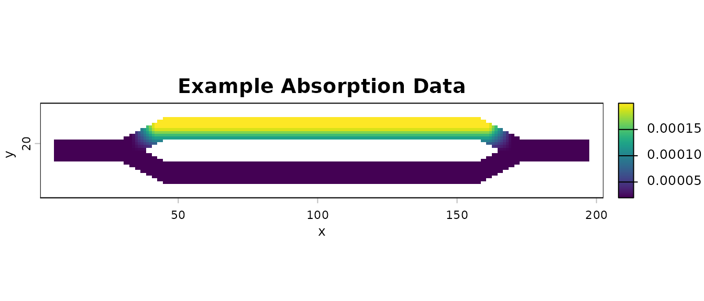
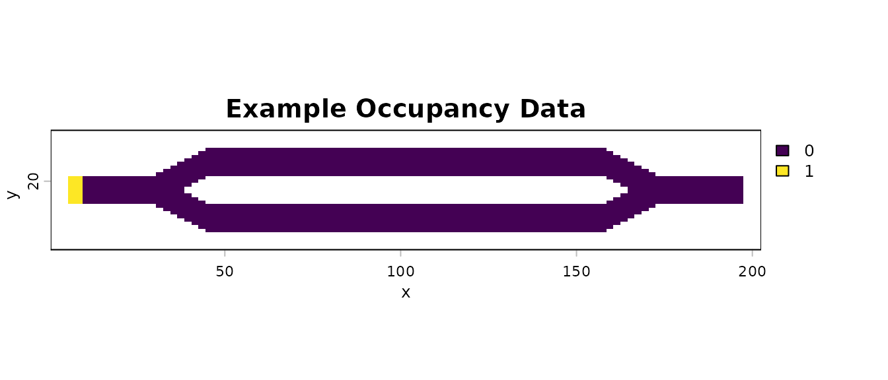
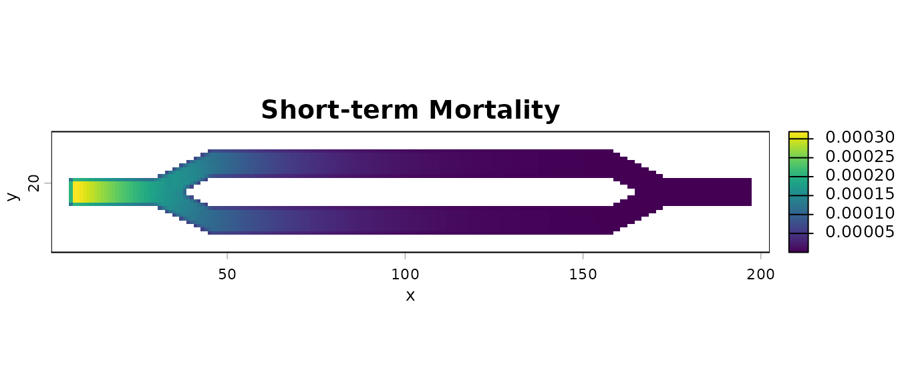
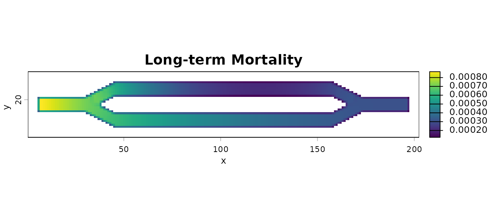
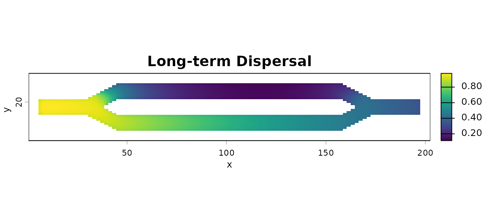

# Basic Tutorial

## Introduction

This tutorial shows the basics of how to use the package to calculate
and visualize several metrics using map based inputs. It utilizes the
package’s built-in data, which is the same example data used in Fletcher
et al. (2019).

## Libraries

``` r
# First step is to load the libraries. Not all of these libraries are stricly
# needed; some are used for convenience and visualization for this tutorial.
library("terra")
library("samc")
library("viridisLite")
```

## Load the Data

``` r
# "Load" the data. In this case we are using data built into the package.
# In practice, users will likely load raster data using the raster() function
# from the raster package.
res_data <- samc::example_split_corridor$res
abs_data <- samc::example_split_corridor$abs
init_data <- samc::example_split_corridor$init

# To make things easier for plotting later, convert the matrices to rasters
res_data <- samc::rasterize(res_data)
abs_data <- samc::rasterize(abs_data)
init_data <- samc::rasterize(init_data)


# Plot the data and make sure it looks good. The built-in data is in matrices, 
# so we use the raster() function to help with the plotting. Note that when
# matrices are used by the package, it sets the extents based on the number of
# rows/cols. We do the same thing here when converting to a raster, otherwise
# the default extents will be (0,1) for both x and y, which is not only
# uninformative, but can result in "stretching" when visualizing datasets
# based non-square matrices.
plot(res_data, main = "Example Resistance Data", xlab = "x", ylab = "y", col = viridis(256))
plot(abs_data, main = "Example Absorption Data", xlab = "x", ylab = "y", col = viridis(256))
plot(init_data, main = "Example Occupancy Data", xlab = "x", ylab = "y", col = viridis(256))
```



## Create the `samc` Object

``` r
# Setup the details for our transition function
rw_model <- list(fun = function(x) 1/mean(x), # Function for calculating transition probabilities
                 dir = 8, # Directions of the transitions. Either 4 or 8.
                 sym = TRUE) # Is the function symmetric?

# Create a `samc-class` object using the resistance and absorption data. We use the
# recipricol of the arithmetic mean for calculating the transition matrix. Note,
# the input data here are matrices, not RasterLayers.
samc_obj <- samc(res_data, abs_data, model = rw_model)


# Print out the samc object and make sure everything is filled out. Try to
# double check some of the values, such as the nrows/ncols of the landscape
# data. The dimensions of the matrix (slot p) should be the number of non-NA
# cells in your data +1. In this case, our data has 2624 non-NA cells, so the
# matrix should be 2625 x 2625
str(samc_obj)
#> Formal class 'samc' [package "samc"] with 15 slots
#>   ..@ data      :Formal class 'samc_data' [package "samc"] with 3 slots
#>   .. .. ..@ f    :Formal class 'dgCMatrix' [package "Matrix"] with 6 slots
#>   .. .. .. .. ..@ i       : int [1:21612] 0 1 115 116 117 0 1 2 116 117 ...
#>   .. .. .. .. ..@ p       : int [1:2625] 0 5 11 17 23 29 35 41 47 53 ...
#>   .. .. .. .. ..@ Dim     : int [1:2] 2624 2624
#>   .. .. .. .. ..@ Dimnames:List of 2
#>   .. .. .. .. .. ..$ : NULL
#>   .. .. .. .. .. ..$ : NULL
#>   .. .. .. .. ..@ x       : num [1:21612] 1 -0.226 -0.138 -0.163 -0.104 ...
#>   .. .. .. .. ..@ factors : list()
#>   .. .. ..@ t_abs: num [1:2624] 2e-04 2e-04 2e-04 2e-04 2e-04 ...
#>   .. .. ..@ c_abs: num[0 , 0 ] 
#>   ..@ conv_cache: NULL
#>   ..@ model     :List of 4
#>   .. ..$ fun :function (x)  
#>   .. ..$ dir : num 8
#>   .. ..$ sym : logi TRUE
#>   .. ..$ name: chr "RW"
#>   ..@ source    : chr "SpatRaster"
#>   ..@ nodes     : int 2624
#>   ..@ map       :S4 class 'SpatRaster' [package "terra"]
#>   ..@ crw_map   : NULL
#>   ..@ prob_mat  : NULL
#>   ..@ names     : NULL
#>   ..@ clumps    : int 1
#>   ..@ override  : logi FALSE
#>   ..@ solver    : chr "direct"
#>   ..@ threads   : num 1
#>   ..@ precision : chr "double"
#>   ..@ .cache    :<environment: 0x564274b1f068>
```

## Basic Analysis

``` r
# Convert the initial state data to probabilities
init_prob_data <- init_data / sum(values(init_data), na.rm = TRUE)


# Calculate short- and long-term mortality metrics and long-term dispersal
short_mort <- mortality(samc_obj, init_prob_data, time = 4800)
long_mort <- mortality(samc_obj, init_prob_data)
long_disp <- dispersal(samc_obj, init_prob_data)
#> 
#> Cached diagonal not found.
#> Performing setup. This can take several minutes... Complete.
#> Calculating matrix inverse diagonal...
#> Computing: 100% (done)                         
#> Complete                                                      
#> Diagonal has been cached. Continuing with metric calculation...
```

## Visualization

``` r
# Create rasters using the vector result data for plotting.
short_mort_map <- map(samc_obj, short_mort)
long_mort_map <- map(samc_obj, long_mort)
long_disp_map <- map(samc_obj, long_disp)


# Plot the mortality and dispersal results
plot(short_mort_map, main = "Short-term Mortality", xlab = "x", ylab = "y", col = viridis(256))
plot(long_mort_map, main = "Long-term Mortality", xlab = "x", ylab = "y", col = viridis(256))
plot(long_disp_map, main = "Long-term Dispersal", xlab = "x", ylab = "y", col = viridis(256))
```


