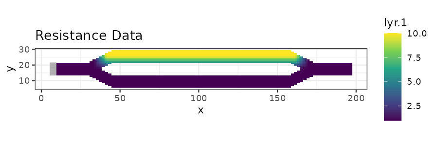
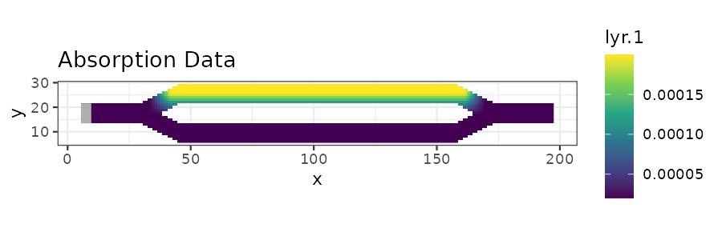
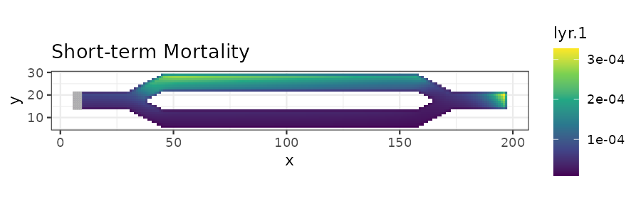
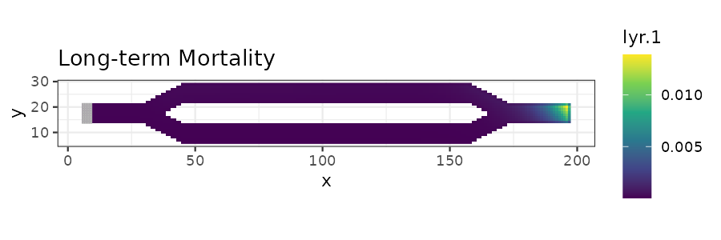
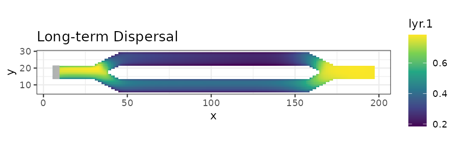

# ggplot Visualization

## Introduction

This tutorial shows how to plot samc analyses using ggplot2. It is based
on the code in the basic tutorial.

## Setup

``` r
# First step is to load the libraries. Not all of these libraries are stricly
# needed; some are used for convenience and visualization for this tutorial.
library("terra")
library("samc")
library("ggplot2")


# "Load" the data. In this case we are using data built into the package.
# In practice, users will likely load raster data using the raster() function
# from the raster package.
res_data <- samc::example_split_corridor$res
abs_data <- samc::example_split_corridor$abs
init_data <- samc::example_split_corridor$init

# To make things easier for plotting later, convert the matrices to rasters
res_data <- samc::rasterize(res_data)
abs_data <- samc::rasterize(abs_data)
init_data <- samc::rasterize(init_data)


# Setup the details for our transition function
rw_model <- list(fun = function(x) 1/mean(x), # Function for calculating transition probabilities
                 dir = 8, # Directions of the transitions. Either 4 or 8.
                 sym = TRUE) # Is the function symmetric?

# Create a samc object using the resistance and absorption data. We use the
# recipricol of the arithmetic mean for calculating the transition matrix. Note,
# the input data here are matrices, not RasterLayers.
samc_obj <- samc(res_data, abs_data, model = rw_model)


# Convert the initial state data to probabilities
init_prob_data <- init_data / sum(values(init_data), na.rm = TRUE)


# Calculate short- and long-term mortality metrics and long-term dispersal
short_mort <- mortality(samc_obj, init_prob_data, time = 4800)
long_mort <- mortality(samc_obj, init_prob_data)
long_disp <- dispersal(samc_obj, init_prob_data)


# Create rasters using the vector result data for plotting.
short_mort_map <- map(samc_obj, short_mort)
long_mort_map <- map(samc_obj, long_mort)
long_disp_map <- map(samc_obj, long_disp)
```

## Visualization With ggplot2

``` r
# Convert the landscape data to RasterLayer objects, then to data frames for ggplot
res_df <- as.data.frame(res_data, xy = TRUE, na.rm = TRUE)
abs_df <- as.data.frame(abs_data, xy = TRUE, na.rm = TRUE)
init_df <- as.data.frame(init_data, xy = TRUE, na.rm = TRUE)


# When overlaying the patch raster, we don't want to plot cells with values of 0
init_df <- init_df[init_df$lyr.1 != 0, ]


# Plot the example resistance and mortality data using ggplot
res_plot <- ggplot(res_df, aes(x = x, y = y)) +
  geom_raster(aes(fill = lyr.1)) +
  scale_fill_viridis_c() +
  geom_tile(data = init_df, aes(x = x, y = y, fill = lyr.1), fill = "grey70", color = "grey70") +
  ggtitle("Resistance Data") +
  coord_equal() + theme_bw()
print(res_plot)

abs_plot <- ggplot(abs_df, aes(x = x, y = y)) +
  geom_raster(aes(fill = lyr.1)) +
  scale_fill_viridis_c() +
  geom_tile(data = init_df, aes(x = x, y = y, fill = lyr.1), fill = "grey70", color = "grey70") +
  ggtitle("Absorption Data") +
  coord_equal() + theme_bw()
print(abs_plot)
```





``` r
# Convert result RasterLayer objects to data frames for ggplot
short_mort_df <- as.data.frame(short_mort_map, xy = TRUE, na.rm = TRUE)
long_mort_df <- as.data.frame(long_mort_map, xy = TRUE, na.rm = TRUE)
long_disp_df <- as.data.frame(long_disp_map, xy = TRUE, na.rm = TRUE)


# Plot short-term mortality
stm_plot <- ggplot(short_mort_df, aes(x = x, y = y)) +
  geom_raster(aes(fill = lyr.1)) +
  scale_fill_viridis_c() +
  geom_tile(data = init_df, aes(x = x, y = y, fill = lyr.1), fill = "grey70", color = "grey70") +
  ggtitle("Short-term Mortality") +
  coord_equal() + theme_bw()
print(stm_plot)

# Plot long-term mortality
ltm_plot <- ggplot(long_mort_df, aes(x = x, y = y)) +
  geom_raster(aes(fill = lyr.1)) +
  scale_fill_viridis_c() +
  geom_tile(data = init_df, aes(x = x, y = y,fill = lyr.1), fill = "grey70", color = "grey70") +
  ggtitle("Long-term Mortality") +
  coord_equal() + theme_bw()
print(ltm_plot)

# Plot long-term dispersal
ltd_plot <- ggplot(long_disp_df, aes(x = x, y = y)) +
  geom_raster(aes(fill = lyr.1)) +
  scale_fill_viridis_c() +
  geom_tile(data = init_df, aes(x = x, y = y, fill = lyr.1), fill = "grey70", color = "grey70") +
  ggtitle("Long-term Dispersal") +
  coord_equal() + theme_bw()
print(ltd_plot)
```






