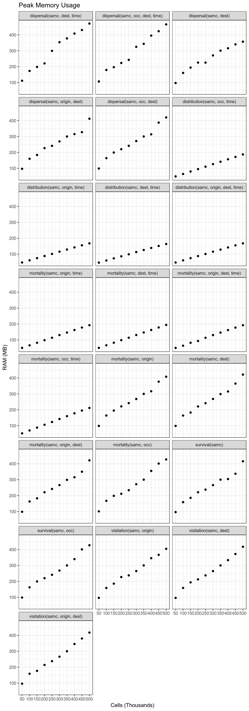

```{r setup, include = FALSE}
knitr::opts_chunk$set(
  collapse = TRUE,
  comment = "#>"
)

library(samc)
```

## Introduction

This document provides details about the different performance aspects of the package. There are two general issues users should be aware of: computation time and memory (RAM) usage.

Computation time is the more straightforward of the two. Basically, as the size of the landscape data increases, the amount of time it takes the calculations to run will also increase. Additionally, many functions have a time parameter for calculating short-term metrics. As the time parameter increases, users should expect a proportional increase in computation time (with an important caveat discussed below). A recommended strategy for users is to initially use low resolution version of their landscape data and low time inputs for initially writing and verifying their scripts. This allows users to incrementally test things until they are satisfied everything is working correctly without needing to wait long periods of time for testing. Then, once ready, they can start using their final inputs, or even first incrementally increasing the size of the data and time parameters as a way to gauge how long their final analysis will take to complete.

The more complex issue is RAM usage. All of the calculations involve matrix calculations that can consume large amounts of memory. In some cases, the calculations can be optimized to avoid the more memory intensive calculations, but in other cases it is unavoidable, and will limit how some functions in the package can be used. It is important for users to be aware of the limitations of each function they wish to use. Failing to do so may result in excessive RAM utilization. In some cases, the analysis may still run by using the hard drive as additional RAM, but this will slow the analysis by one to three orders of magnitude, and can cause disk wear that is particularly detrimental to solid state drives (SSDs). Otherwise, the analysis will likely crash R, potentially causing loss of work. Writing the initial analysis using a scaled down versions of the user's landscape data, and then later incrementally increasing the resolution is one approach for determining what is possible to run on a user's system.


## Transition Matrix

All of the calculations performed by the package make use of a transition matrix generated using the landscape data. Technically, the size of the transition matrix grows quadratically with the number of cells in the landscape data, meaning that it can quickly consume a computer's available memory (RAM). The following figure illustrates this, where even a million landscape cells (a 1000x1000 raster without any missing data) requires ~7500 GB of RAM, about 1000x what is typically available in modern consumer computers.

```{r fig1, fig.width = 6.5, fig.asp = 1, fig.align = "center", echo = FALSE}
xdat <- seq(0, 1000000, 10000)
ydat <- (xdat * xdat * 8) / (1024^3)

plot(xdat/1000, ydat,
     main = "Transition Matrix Memory Requirements",
     xlab = "Number of Landscape Cells (Thousands)",
     ylab = "RAM (GB)")

```

Fortunately, the initial transition matrix is sparse (it contains the value `0` in the majority of its cells). This allows the way it is stored in RAM to be optimized so that the amount of memory it consumes only grows linearly with the number of cells in the landscape data. In practice, this means the transition matrix takes up significantly less RAM. Using a 1000x1000 landscape raster (one million landscape cells) again as an example, the transition matrix can be condensed down to less than 0.15 GB of RAM.

```{r fig2, fig.width = 6.5, fig.asp = 1, fig.align = "center", echo = FALSE}
xdat <- seq(0, 1000000, 10000)
ydat <- (xdat * 17 * 8) / (1024^3)

plot(xdat/1000, ydat,
     main = "Transition Matrix Memory Requirements (Optimized)",
     xlab = "Number of Landscape Cells (Thousands)",
     ylab = "RAM (GB)")

```


## Calculations

Just creating a large transition matrix is no longer an issue, but issues still arise when the transition matrix is used in calculations. Some calculations involving the transition matrix, such as calculating the inverse, will produce a dense matrix that cannot be stored in a similarly optimized manner. Instead, the dense matrix will have the same memory requirement as the first figure above. These calculations quickly become impractical with even moderately-low amounts of landscape data. The following figure illustrates how many landscape cells could be practical with consumer hardware when these calculations are involved. This is under *ideal* circumstances; in practice, more than one dense matrix may need to be in memory at the same time to perform some calculations.

```{r fig3, fig.width = 6.5, fig.asp = 1, fig.align = "center", echo = FALSE}
xdat <- seq(0, 50000, 1000)
ydat <- (xdat * xdat * 8) / (1024^3)

plot(xdat/1000, ydat,
     main = "Dense Matrix Memory Requirements",
     xlab = "Number of Landscape Cells (Thousands)",
     ylab = "RAM (GB)")

```

Many of the equations in the SAMC paper perform these calculations. In some cases it is completely unavoidable. Fortunately, in other cases, it is possible to refactor the equations to avoid these particular calculations, or to use other math techniques and tools that limits their downside.


## Short-term Metrics

The short-term metrics (functions where a number of time steps is specified) are expected to have a run time that increases linearly with the number of time steps (as seen in the benchmarks below). Currently, a limitation in the way numbers are stored in computer hardware is causing these calculations to slow down substantially with large time steps (~47000 on one test computer). Until a suitable workaround is identified, users are recommended to start their analyses with smaller numbers and increase them incrementally. Plotting these incremental results may reveal that a large number of time steps is not necessary in order for the results to stabilize for some/all short-term metrics.


## Special Cases

#### $\psi^TD$ | dispersal(samc, occ)

Calculating $\psi^TD$ has been optimized for memory usage, but due to the requirement of calculating $diag(F)$, remains substantially slower than solutions for metrics. Additionally, as the number of landscape cells increases, the time to compute the result increases quadratically. Given that the calculation is still possible on computers with limited memory resources, it is enabled by default, but while running it will provide status updates for three different parts of the calculation. The first and third part involves matrix decompositions that generally will only take less than a few minutes, but could take several minutes with large landscapes. The second stage is by far the most time consuming part of the calculation, and a time estimate will be periodically updated to give users a rough estimate of how long it will take to complete. The first few time estimates tend to be inflated due to the low sampling time, but will improve with each update.


## Benchmarks

This section includes automated benchmarks for each method that has been optimized to avoid memory issues. This information is primarily for prioritizing future optimizations, but is published in case some users find it helpful. The benchmarking approach is crude and there may be occasional outliers as a result. Computation time could vary quite a lot with different hardware. 


#### Overall Performance

Performance of each of the functions relative to number of landscape cells. For short-term metrics, the number of time steps was set to `10000`.

```{r fig4, out.width = '100%', fig.align = "center", echo = FALSE}
knitr::include_graphics("img/bt.png")
```


#### Overall Memory Usage

Maximum amount of RAM needed by each function at any single point in the computation. Note that this does not include the memory used by other objects in the code (such as the `samc-class` object), or other programs running on the computer. For short-term metrics, the number of time steps was set to `10000`.

```{r fig5, out.width = '100%', fig.align = "center", echo = FALSE}

```


#### Temporal Performance

Performance of each of the short-term metrics for varying number of time steps. The number of landscape cells used for this benchmark was 500,000.

```{r fig6, out.width = '100%', fig.align = "center", echo = FALSE}
knitr::include_graphics("img/btt.png")
```


#### Temporal Memory Usage

Maximum amount of RAM needed by each short-term metric for varying number of time steps. Note that this does not include the memory used by other objects in the code (such as the `samc-class` object), or other programs running on the computer. The number of landscape cells used for this benchmark was 500,000.

```{r fig7, out.width = '100%', fig.align = "center", echo = FALSE}
knitr::include_graphics("img/btr.png")
```
