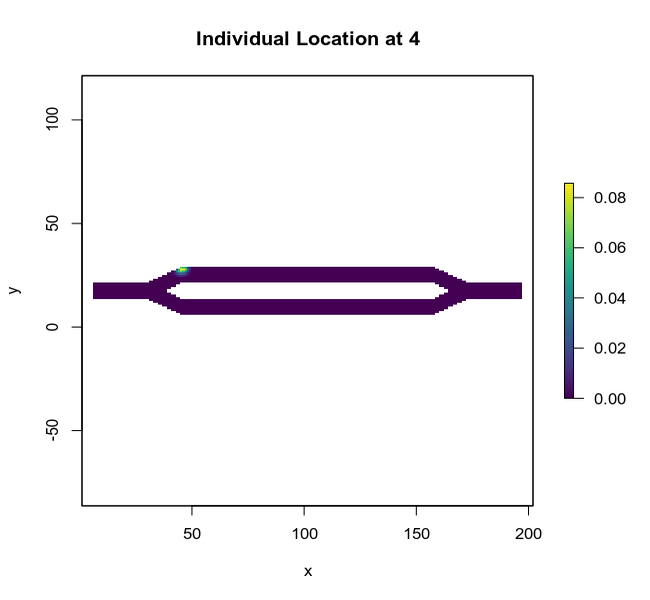
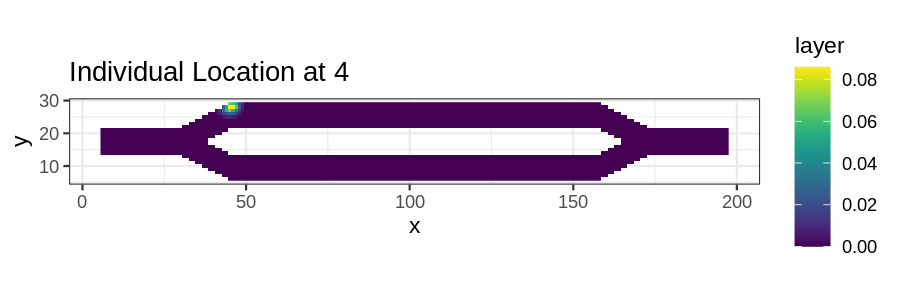

```{r setup, include = FALSE}
knitr::opts_chunk$set(
  collapse = TRUE,
  comment = "#>"
)

do.call(knitr::read_chunk, list(path = "scripts/tutorial-animations.R"))
```

## Introduction

This tutorial illustrates two different approaches for creating animated plots from temporal analyses. The first is using the base plot tools in R with the gifski package. The second is using gganimate (which uses gifski under the hood). While the gganimate approach might be the more user friendly of the two, it does not appear to have a mechanism available for dynamically adjusting the color scale each frame, so later frames will appear dark as the probability values in the results decrease over time (as seen below). The gifski package simply merges several different plots, so the color scale can be different for each frame. It can also be used with ggplot instead of base plot if users desire the style of ggplot with dynamic color scales.


## Setup

```{r eval = FALSE}
<<setup>>
```


## Using gifski

```{r eval = FALSE}
<<gifski>>
```

```{r fig1, out.width = '100%', fig.align = "center", echo = FALSE}

```


## Using gganimate

```{r eval = FALSE}
<<gganimate>>
```

```{r fig2, out.width = '100%', fig.align = "center", echo = FALSE}

```


