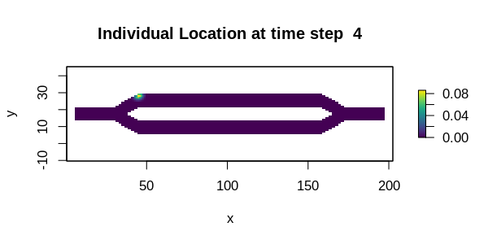

```{r setup, include = FALSE}
knitr::opts_chunk$set(
  collapse = TRUE,
  comment = "#>"
)

required <- c("ggplot2", "gifski", "png", "viridis", "gganimate")
if (!all(sapply(required, requireNamespace, quietly = TRUE))) {
  knitr::opts_chunk$set(eval = FALSE)
}
```

## Introduction

This tutorial illustrates two different approaches for creating animated plots from temporal analyses. The first is using the base plot tools in R with the gifski package. The second is using gganimate (which uses gifski under the hood). While the gganimate approach might be the more user friendly of the two, it does not appear to have a mechanism available for dynamically adjusting the color scale each frame, so later frames will appear dark as the probability values in the results decrease over time (as seen below). The gifski package simply merges several different plots, so the color scale can be different for each frame. It can also be used with ggplot instead of base plot if users desire the style of ggplot with dynamic color scales.


## Setup

```{r, message = FALSE}
# First step is to load the libraries. Not all of these libraries are stricly
# needed; some are used for convenience and visualization for this tutorial.
library("samc")
library("raster")
library("ggplot2")
library("viridis")
library("gifski")
library("gganimate")


# "Load" the data. In this case we are using data built into the package.
# In practice, users will likely load raster data using the raster() function
# from the raster package.
res_data <- samc::ex_res_data
abs_data <- samc::ex_abs_data
occ_data <- samc::ex_occ_data


# Create a samc object using the resistance and absorption data. We use the 
# recipricol of the arithmetic mean for calculating the transition matrix. Note,
# the input data here are matrices, not RasterLayers. If using RasterLayers, the
# `latlon` parameter must be set.
samc_obj <- samc(res_data, abs_data, tr_fun = function(x) 1/mean(x))


# Calculate the probabilities of where an individual starting at specific
# location will be for varying time steps. The starting location is going to
# be cell 1 in the landscape, which is the first non-NA cell going in a 
# left-to-right then top-to-bottom order.
time_steps <- ((1:50)*2) ^ 2

dist_list <- list()
for (i in 1:length(time_steps)) {
  dist_list[[i]] <- distribution(samc_obj, origin = 1, time = time_steps[i])
}
```


## Using gifski

```{r eval = FALSE}
# Adapted from the example in the gifski package reference
png_path <- file.path(tempdir(), "frame%03d.png")
png(png_path)
par(ask = FALSE)

for (i in 1:length(time_steps)) {
  temp_map <- map(samc_obj, dist_list[[i]])
  plot(temp_map, main = paste("Individual Location at", time_steps[i]), xlab = "x", ylab = "y", col = viridis(256))
}

dev.off()
png_files <- sprintf(png_path, 1:length(time_steps))
gif_file <- tempfile(fileext = ".gif")
gifski(png_files, gif_file, delay = 0.1, progress = FALSE)
unlink(png_files)
utils::browseURL(gif_file)
```

```{r fig1, out.width = '100%', fig.align = "center", echo = FALSE}

```


## Using gganimate

```{r fig2, fig.width = 6.5, out.width = '100%', dpi = 300, fig.align = "center"}
# Create an empty dataframe to hold all the data from all the plots
dist_df <- data.frame(x = numeric(0), y = numeric(0), layer = numeric(0), steps = numeric(0))

for (ts in time_steps) {
  dist <- distribution(samc_obj, origin = 1, time = ts)
  dist <- as.data.frame(map(samc_obj, dist), xy = TRUE, na.rm = TRUE)
  dist$steps <- ts
  
  dist_df <- rbind(dist_df, dist)
}


# Create the animation. Unfortunately, there does not appear to be a way to 
# adjust the color scale dynamically across frames using gganimate at this time
anim <- ggplot(dist_df, aes(x = x, y = y)) +
  geom_raster(aes(fill = layer)) +
  transition_manual(steps) +
  scale_fill_viridis(limits = c(0, max(dist_df$layer))) +
  ggtitle("Individual Location at {current_frame}") +
  coord_equal() +
  theme_bw()

animate(anim, duration = 5)
```


