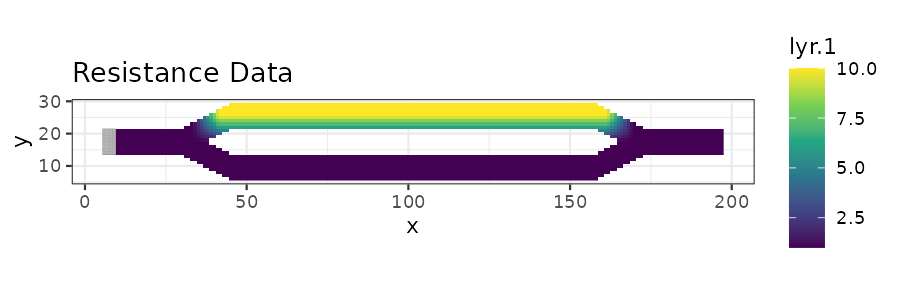
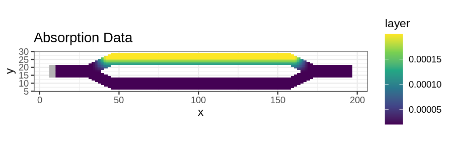
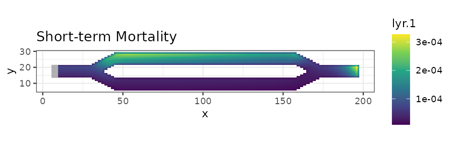
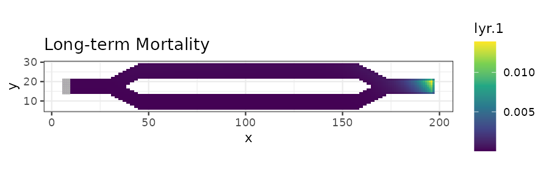
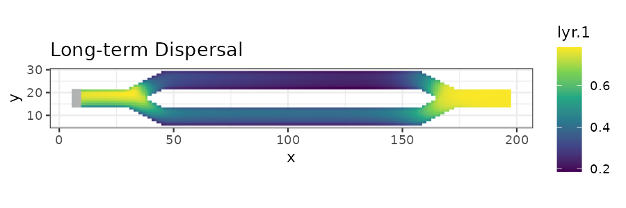

```{r setup, include = FALSE}
knitr::opts_chunk$set(
  collapse = TRUE,
  comment = "#>"
)

do.call(knitr::read_chunk, list(path = "scripts/tutorial-ggplot.R"))
```

## Introduction

This tutorial shows how to plot samc analyses using ggplot2. It is based on the code in the basic tutorial.


## Setup

```{r eval=FALSE}
<<setup>>
```


## Visualization With ggplot2

```{r eval=FALSE}
<<data>>
```

```{r fig1, out.width = '100%', fig.align = "center", echo = FALSE}

```

```{r fig2, out.width = '100%', fig.align = "center", echo = FALSE}

```

```{r eval=FALSE}
<<results>>
```

```{r fig3, out.width = '100%', fig.align = "center", echo = FALSE}

```

```{r fig4, out.width = '100%', fig.align = "center", echo = FALSE}

```

```{r fig5, out.width = '100%', fig.align = "center", echo = FALSE}

```
